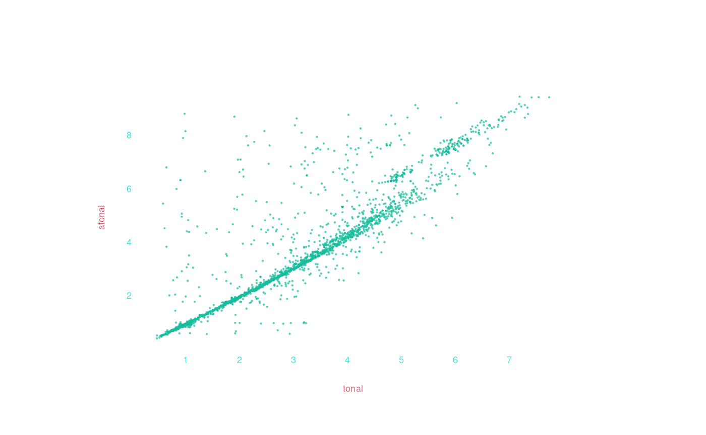

# Using ppidyom with humdrumR

Though it can be used on any R data vectors, `ppidyom` is fully
incorporated into [humdrumR](https://humdrumr.ccml.gtcmt.gatech.edu/),
making it very easy to apply to existing musical datasets using various
operational definitions (“viewpoints”).

``` r
library(humdrumR)
library(ppidyom)
```

## First examples

Let’s start with trusty Bach chorales, the first ten of which are
packaged with humdrumR. To load them, we just need this:

``` r

chorales <- readHumdrum(humdrumRroot, "HumdrumData/BachChorales/.*krn")
#> Finding and reading files...
#>  REpath-pattern '/home/nat/R/x86_64-pc-linux-gnu-library/4.5/humdrumR/HumdrumData/BachChorales/.*krn' matches 10 text files in 1 directory.
#> Ten files read from disk.
#> Validating ten files...all valid.
#> Parsing ten files...Assembling corpus...Done!
```

If you have any other humdrum data on your machine, you can just pass
[`readHumdrum()`](https://rdrr.io/pkg/humdrumR/man/readHumdrum.html) the
path and pattern to match your files.

Before applying ppidyom, consider what dimension of the music you want
to model, and your *operational definition* for that dimension. This
choral data is encoded as `**kern`, which means it has relative rhythm
data and absolute pitch encoded for each note, as well as notation
details like stem direction. Here we’ll consider just focus on modeling
pitch, ignoring rhythm. But “pitch” can be viewed different ways:
absolute vs relative, tonal vs atonal, etc.

Let’s start with simple (no octave information) scale degree, which we
can extract using `solfa(simple = TRUE)`. We can then pass that straight
to
[`ppidyom()`](https://ppidyom.ccml.gtcmt.gatech.edu/reference/ppidyom.md):

``` r

chorales |> solfa(simple = TRUE) |> ppidyom()
#> ppidyom: 10 long-term group(s), N=5, model=stm, ppm=interpolation, alphabet=15
#> i is 1 in lt_groups
#>  [1] "do" "do" "la" "ti" "do" "so" "la" "fa" "mi" "re" "do" "so" "do" "ti" "do"
#> [16] "re" "mi" "fa" "so" "do" "do" "do" "re" "mi" "mi" "re" "do" "so" "la" "la"
#> [31] "so" "fa" "mi" "fa" "so" "do" "re" "mi" "do" "fa" "do" "ti" "do" "re" "mi"
#> [46] "do" "so" "la" "so" "fa" "mi" "re" "do" "so" "do" "do" "ti" "la" "la" "so"
#> [61] "fa" "so" "do"
#>  [1] "mi" "mi" "fa" "mi" "re" "do" "ti" "do" "fa" "mi" "fa" "so" "so" "so" "re"
#> [16] "mi" "fa" "so" "la" "so" "fa" "mi" "so" "so" "fa" "mi" "re" "mi" "fa" "so"
#> [31] "so" "so" "mi" "do" "mi" "la" "so" "so" "so" "fa" "so" "so" "fa" "mi" "fa"
#> [46] "so" "so" "fa" "mi" "fa" "so" "so" "so" "so" "la" "la" "so" "fa" "mi"
#>  [1] "so" "so" "la" "so" "so" "mi" "la" "so" "la" "ti" "do" "ti" "do" "so" "la"
#> [16] "ti" "do" "ti" "so" "do" "do" "ti" "la" "ti" "do" "do" "re" "do" "ti" "do"
#> [31] "ti" "la" "la" "ti" "do" "re" "re" "do" "ti" "do" "te" "la" "do" "re" "do"
#> [46] "ti" "do" "ti" "ti" "la" "la" "ti" "do" "ti" "do" "re" "do" "ti" "do" "ti"
#> [61] "so"
#>  [1] "do" "do" "so" "mi" "re" "do" "do" "re" "mi" "re" "mi" "so" "fa" "mi" "re"
#> [16] "do" "mi" "mi" "fa" "so" "so" "fa" "mi" "re" "do" "mi" "fa" "so" "fa" "mi"
#> [31] "do" "mi" "so" "fa" "mi" "re" "do" "re" "mi" "re" "mi" "so" "fa" "mi" "re"
#> [46] "do"
#>   [1/10] 0.3s elapsed, 2.6s remaining
#> i is 2 in lt_groups
#>  [1] "do" "ti" "la" "mi" "fa" "fi" "so" "re" "so" "so" "do" "re" "mi" "re" "do"
#> [16] "re" "re" "so" "mi" "la" "ti" "do" "so" "mi" "do" "fa" "mi" "fa" "so" "mi"
#> [31] "re" "mi" "fa" "te" "la" "re" "mi" "la" "so" "fa" "mi" "re" "do" "re" "mi"
#> [46] "fa" "so" "re" "la" "ti" "do" "ti" "so" "do" "do" "ti" "la" "so" "fa" "so"
#> [61] "do"
#>  [1] "mi" "mi" "mi" "re" "do" "ti" "la" "re" "do" "ti" "so" "so" "fi" "mi" "re"
#> [16] "do" "ti" "ti" "do" "re" "mi" "fa" "so" "so" "fa" "so" "so" "so" "la" "re"
#> [31] "di" "re" "mi" "fa" "ti" "do" "ti" "la" "so" "so" "fa" "mi" "fa" "so" "la"
#> [46] "ti" "la" "la" "so" "fa" "mi" "re" "mi" "fa" "so" "fa" "mi" "la" "re" "so"
#> [61] "fa" "mi"
#>  [1] "so" "la" "so" "la" "la" "so" "fi" "re" "ti" "do" "ti" "la" "so" "so" "fi"
#> [16] "re" "mi" "re" "do" "do" "ti" "do" "te" "la" "ti" "do" "ti" "di" "re" "do"
#> [31] "te" "la" "so" "la" "la" "so" "fa" "mi" "fa" "so" "la" "ti" "do" "so" "re"
#> [46] "do" "ti" "la" "so" "la" "ti" "do" "do" "ti" "so"
#>  [1] "do" "do" "do" "do" "re" "te" "la" "so" "re" "mi" "re" "do" "ti" "la" "ti"
#> [16] "la" "so" "so" "fa" "mi" "re" "do" "do" "re" "mi" "re" "mi" "fa" "mi" "re"
#> [31] "di" "re" "so" "do" "re" "mi" "fa" "so" "fa" "mi" "re" "fa" "mi" "re" "so"
#> [46] "fa" "mi" "re" "do" "re" "mi" "re" "do"
#>   [2/10] 0.6s elapsed, 2.3s remaining
#> i is 3 in lt_groups
#>  [1] "so" "do" "re" "me" "re" "do" "ti" "do" "so" "re" "me" "fa" "so" "le" "so"
#> [16] "fa" "so" "do" "la" "te" "la" "so" "re" "do" "te" "la" "so" "fa" "me" "re"
#> [31] "so" "le" "me" "fa" "so" "do" "re" "me" "fa" "so" "do" "do" "ti" "do" "te"
#> [46] "le" "so" "fa" "mi" "fa" "fi" "so"
#>  [1] "so" "so" "fa" "so" "fa" "me" "re" "me" "fa" "so" "le" "so" "so" "fa" "me"
#> [16] "fa" "ti" "do" "ti" "me" "do" "te" "do" "re" "re" "re" "do" "re" "me" "la"
#> [31] "so" "fa" "me" "fa" "so" "so" "so" "fa" "me" "re" "me" "me" "re" "do" "do"
#> [46] "ra" "do" "so" "la" "ti"
#>  [1] "ti" "do" "ti" "do" "ti" "do" "re" "so" "la" "ti" "ti" "do" "ti" "do" "te"
#> [16] "le" "so" "so" "fa" "fa" "fi" "so" "fi" "so" "fi" "so" "te" "la" "so" "fi"
#> [31] "re" "do" "do" "ti" "do" "so" "so" "so" "so" "so" "so" "le" "te" "la" "ti"
#> [46] "do" "so"
#>  [1] "re" "me" "re" "do" "so" "so" "fa" "me" "re" "fa" "me" "re" "do" "re" "me"
#> [16] "fa" "me" "re" "do" "do" "re" "do" "te" "la" "so" "la" "te" "do" "re" "te"
#> [31] "do" "re" "me" "re" "me" "re" "do" "ti" "do" "do" "so" "me" "fa" "so" "fa"
#> [46] "me" "re"
#>   [3/10] 0.8s elapsed, 1.9s remaining
#> i is 4 in lt_groups
#>  [1] "do" "ti" "so" "do" "re" "mi" "fa" "do" "fa" "ti" "do" "re" "mi" "la" "re"
#> [16] "do" "ti" "la" "so" "re" "so" "do" "la" "ti" "do" "re" "so" "mi" "do" "re"
#> [31] "so" "do" "mi" "do" "fa" "so" "la" "di" "re" "la" "do" "so" "la" "ti" "do"
#> [46] "so" "fi" "so" "do"
#>  [1] "do" "re" "do" "ti" "do" "fa" "so" "la" "te" "do" "te" "la" "so" "so" "fa"
#> [16] "mi" "re" "re" "so" "fi" "re" "mi" "la" "re" "re" "re" "so" "fi" "ti" "do"
#> [31] "so" "do" "do" "la" "te" "la" "la" "so" "so" "do" "do" "ti" "so" "re" "mi"
#>  [1] "mi" "re" "mi" "fa" "mi" "re" "do" "fa" "mi" "do" "re" "do" "do" "ti" "do"
#> [16] "la" "re" "do" "ti" "do" "ti" "do" "re" "mi" "fi" "so" "fi" "so" "so" "re"
#> [31] "re" "mi" "do" "re" "mi" "fa" "do" "re" "mi" "re" "di" "do" "ti" "la" "so"
#> [46] "so" "la" "so" "so"
#>  [1] "so" "so" "so" "so" "te" "la" "so" "fa" "so" "mi" "do" "re" "mi" "fi" "so"
#> [16] "la" "so" "so" "do" "ti" "la" "ti" "do" "ti" "la" "so" "so" "do" "so" "la"
#> [31] "mi" "fa" "so" "fa" "mi" "mi" "re" "fa" "mi" "re" "la" "ti" "do"
#>   [4/10] 1.0s elapsed, 1.5s remaining
#> i is 5 in lt_groups
#>  [1] "do" "fa" "so" "la" "ti" "do" "re" "so" "do" "ti" "do" "ti" "la" "mi" "fa"
#> [16] "so" "do" "do" "ti" "la" "so" "la" "ti" "do" "so" "do" "fa" "do" "te" "la"
#> [31] "so" "fa" "mi" "fa" "so" "la" "re" "so" "do" "re" "mi" "fa" "ti" "di" "re"
#> [46] "re" "la" "di" "re" "mi" "fa" "re" "te" "la" "so" "la" "la" "re" "re" "mi"
#> [61] "fi" "so" "fi" "so" "re" "so" "mi" "la" "so" "do" "ti" "la" "mi" "re" "do"
#> [76] "fa" "mi" "re" "so" "fa" "so" "do"
#>  [1] "mi" "fa" "mi" "re" "la" "re" "mi" "fa" "la" "so" "so" "so" "so" "do" "re"
#> [16] "mi" "do" "la" "re" "mi" "fa" "mi" "mi" "re" "so" "do" "re" "re" "do" "do"
#> [31] "ti" "do" "do" "do" "do" "do" "do" "do" "re" "mi" "re" "re" "do" "do" "so"
#> [46] "fa" "mi" "re" "la" "la" "la" "la" "so" "fa" "mi" "re" "re" "di" "re" "mi"
#> [61] "di" "re" "di" "re" "la" "ti" "do" "so" "fa" "me" "re" "re" "do" "ti" "ti"
#> [76] "do" "so" "so" "la" "so" "la" "so" "fa" "so" "la" "so" "fa" "mi"
#>  [1] "do" "do" "ti" "do" "ti" "la" "do" "do" "ti" "do" "re" "do" "do" "do" "do"
#> [16] "do" "ti" "so" "so" "so" "la" "ti" "la" "la" "so" "so" "fa" "mi" "la" "so"
#> [31] "la" "te" "la" "ti" "do" "ti" "do" "re" "ti" "so" "do" "do" "re" "mi" "mi"
#> [46] "di" "re" "di" "mi" "re" "la" "fa" "so" "la" "te" "la" "so" "fa" "re" "so"
#> [61] "la" "te" "la" "so" "la" "la" "so" "so" "fi" "so" "so" "fa" "mi" "re" "do"
#> [76] "ti" "do" "do" "ti" "do" "do" "do" "do" "ti" "so"
#>  [1] "so" "la" "so" "fa" "mi" "fa" "so" "fa" "mi" "fa" "mi" "re" "mi" "fa" "so"
#> [16] "fa" "mi" "re" "do" "re" "do" "do" "re" "mi" "fa" "mi" "re" "mi" "re" "do"
#> [31] "do" "re" "mi" "fa" "so" "la" "mi" "fi" "so" "mi" "fa" "so" "la" "so" "fa"
#> [46] "mi" "fa" "mi" "la" "la" "la" "re" "so" "fa" "mi" "re" "fa" "mi" "re" "do"
#> [61] "re" "do" "te" "la" "so" "so" "do" "re" "mi" "fa" "so" "fa" "mi" "re" "mi"
#> [76] "fa" "re" "do"
#>   [5/10] 1.4s elapsed, 1.4s remaining
#> i is 6 in lt_groups
#>  [1] "do" "do" "ti" "te" "la" "so" "la" "ti" "so" "do" "fa" "mi" "re" "do" "mi"
#> [16] "so" "do" "mi" "fi" "so" "la" "do" "mi" "re" "do" "la" "re" "so" "do" "re"
#> [31] "mi" "fa" "so" "do"
#>  [1] "mi" "so" "so" "so" "la" "re" "so" "so" "fa" "so" "la" "fa" "so" "so" "so"
#> [16] "do" "do" "ti" "ti" "la" "so" "so" "fi" "ti" "so" "fa" "so" "la" "so" "fa"
#> [31] "mi"
#>  [1] "so" "do" "re" "do" "do" "ti" "do" "re" "ti" "do" "do" "do" "ti" "do" "ti"
#> [16] "do" "mi" "mi" "re" "re" "so" "fa" "mi" "mi" "mi" "re" "re" "do" "do" "ti"
#> [31] "do" "do" "ti" "so"
#>  [1] "do" "mi" "re" "mi" "fa" "so" "mi" "la" "so" "fa" "mi" "re" "mi" "so" "la"
#> [16] "ti" "do" "ti" "la" "so" "mi" "fa" "mi" "re" "re" "do"
#>   [6/10] 1.6s elapsed, 1.0s remaining
#> i is 7 in lt_groups
#>  [1] "do" "la" "mi" "fa" "fa" "mi" "fa" "so" "do" "do" "si" "mi" "la" "so" "fa"
#> [16] "mi" "fa" "so" "do" "do" "fa" "do" "ti" "la" "si" "la" "re" "mi" "la" "fi"
#> [31] "so" "fa" "mi" "do" "re" "so" "mi" "la" "so" "la" "ti" "la" "so" "do" "do"
#> [46] "fa" "mi" "re" "re" "do" "te" "la" "so" "la" "te" "la" "re" "so" "do" "ti"
#> [61] "la" "re" "do" "te" "mi" "fa" "do" "fi" "so" "do" "re" "so" "mi" "la" "so"
#> [76] "re" "mi" "fa" "fi" "so" "si" "la" "ti" "do" "so" "la" "fa" "so" "so" "do"
#>  [1] "mi" "mi" "mi" "do" "ti" "do" "ti" "do" "mi" "mi" "re" "do" "so" "so" "la"
#> [16] "so" "mi" "mi" "fa" "so" "si" "la" "ti" "mi" "fa" "mi" "do" "do" "ti" "do"
#> [31] "re" "mi" "re" "do" "ti" "ti" "do" "fa" "re" "so" "so" "fa" "so" "la" "re"
#> [46] "so" "fa" "mi" "re" "di" "re" "ti" "do" "do" "re" "re" "re" "do" "te" "la"
#> [61] "do" "la" "re" "mi" "re" "do" "ti" "ti" "do" "re" "re" "do" "ti" "fa" "do"
#> [76] "ti" "mi" "la" "so" "so" "so" "fa" "mi" "la" "so" "fa" "mi"
#>  [1] "so" "la" "so" "fa" "mi" "re" "so" "la" "so" "so" "so" "la" "ti" "si" "la"
#> [16] "ti" "do" "ti" "so" "so" "la" "ti" "do" "re" "do" "ti" "la" "si" "mi" "la"
#> [31] "so" "so" "so" "fi" "re" "mi" "mi" "la" "so" "la" "ti" "do" "te" "la" "do"
#> [46] "re" "re" "do" "te" "do" "re" "so" "fi" "so" "so" "la" "la" "te" "te" "la"
#> [61] "so" "fa" "so" "la" "so" "so" "fi" "re" "mi" "mi" "fi" "so" "fi" "so" "la"
#> [76] "ti" "do" "so" "ti" "do" "re" "do" "ti" "do" "do" "ti" "so"
#>  [1] "do" "do" "ti" "la" "so" "do" "re" "mi" "mi" "mi" "re" "mi" "mi" "re" "do"
#> [16] "re" "do" "do" "do" "re" "mi" "re" "mi" "do" "ti" "la" "re" "re" "do" "ti"
#> [31] "do" "la" "so" "so" "do" "do" "re" "re" "mi" "re" "mi" "do" "do" "fa" "fa"
#> [46] "mi" "re" "mi" "re" "re" "mi" "mi" "fa" "fa" "so" "do" "mi" "re" "do" "ti"
#> [61] "do" "la" "so" "so" "do" "ti" "la" "so" "re" "mi" "re" "mi" "fa" "mi" "re"
#> [76] "do" "ti" "do" "re" "mi" "re" "do"
#>   [7/10] 2.1s elapsed, 0.9s remaining
#> i is 8 in lt_groups
#>   [1] "do" "te" "le" "so" "fa" "so" "do" "do" "do" "te" "le" "so" "fa" "me" "le"
#>  [16] "te" "me" "le" "so" "fa" "so" "le" "fa" "so" "do" "do" "re" "mi" "do" "fa"
#>  [31] "so" "le" "fa" "te" "do" "re" "te" "me" "me" "le" "te" "do" "le" "fa" "so"
#>  [46] "le" "fa" "te" "so" "do" "fa" "fa" "me" "re" "do" "fa" "so" "do" "do" "re"
#>  [61] "me" "fa" "so" "la" "te" "do" "re" "re" "so" "so" "do" "te" "le" "so" "fa"
#>  [76] "so" "le" "te" "te" "me" "me" "le" "te" "le" "so" "fa" "so" "le" "fa" "te"
#>  [91] "do" "te" "le" "so" "le" "te" "so" "do" "ti" "do" "re" "me" "re" "me" "fa"
#> [106] "so" "so" "do" "do"
#>  [1] "me" "mi" "fa" "so" "le" "so" "fa" "me" "me" "so" "fa" "te" "te" "do" "te"
#> [16] "le" "so" "le" "le" "re" "do" "me" "le" "so" "fa" "me" "mi" "fa" "so" "mi"
#> [31] "fa" "fa" "fa" "te" "te" "te" "le" "le" "do" "do" "ra" "do" "te" "le" "so"
#> [46] "so" "fa" "so" "le" "so" "fa" "me" "so" "so" "so" "so" "so" "fi" "so" "re"
#> [61] "mi" "mi" "fa" "te" "te" "le" "so" "so" "le" "le" "do" "do" "te" "te" "re"
#> [76] "re" "do" "do" "so" "do" "so" "so" "so" "so"
#>  [1] "do" "do" "do" "ti" "do" "do" "re" "ti" "do" "so" "do" "re" "me" "me" "me"
#> [16] "do" "re" "te" "do" "re" "ti" "do" "do" "ti" "so" "do" "do" "do" "do" "re"
#> [31] "me" "fa" "re" "me" "me" "do" "do" "fa" "fa" "fa" "mi" "do" "ti" "do" "do"
#> [46] "ti" "do" "do" "ti" "so" "me" "me" "re" "re" "re" "me" "re" "do" "ti" "ti"
#> [61] "do" "do" "do" "re" "me" "me" "do" "re" "te" "te" "do" "do" "fa" "fa" "re"
#> [76] "re" "so" "so" "me" "re" "me" "fa" "so" "fa" "me" "re" "re" "mi" "mi"
#>  [1] "so" "so" "fa" "me" "re" "do" "do" "do" "me" "fa" "so" "so" "fa" "me" "me"
#> [16] "me" "fa" "fa" "me" "re" "do" "do" "so" "so" "le" "le" "fa" "fa" "so" "so"
#> [31] "me" "me" "le" "le" "so" "so" "fa" "re" "me" "fa" "me" "re" "re" "do" "do"
#> [46] "do" "te" "te" "la" "la" "so" "so" "so" "so" "le" "so" "fa" "me" "me" "me"
#> [61] "me" "me" "le" "le" "fa" "fa" "te" "te" "so" "so" "do" "do" "ti" "ti" "do"
#> [76] "do"
#>   [8/10] 2.4s elapsed, 0.6s remaining
#> i is 9 in lt_groups
#>  [1] "do" "ti" "la" "so" "do" "ti" "do" "re" "re" "so" "si" "la" "ti" "do" "fa"
#> [16] "fa" "mi" "re" "do" "so" "so" "do" "so" "so" "fa" "mi" "re" "si" "la" "la"
#> [31] "re" "la" "ti" "do" "di" "re" "ri" "mi" "mi" "la" "so" "fa" "mi" "re" "do"
#> [46] "ti" "la" "ti" "do" "la" "fi" "mi" "fi" "re" "so" "mi" "fa" "so" "la" "ti"
#> [61] "do" "fa" "so" "do"
#>  [1] "mi" "mi" "fa" "fa" "so" "mi" "re" "re" "re" "re" "re" "mi" "re" "do" "re"
#> [16] "mi" "fa" "so" "so" "so" "fa" "mi" "so" "la" "ti" "la" "so" "la" "ti" "mi"
#> [31] "la" "so" "fa" "do" "re" "mi" "fa" "so" "la" "fa" "fi" "mi" "mi" "mi" "so"
#> [46] "so" "do" "do" "re" "mi" "la" "so" "la" "fi" "so" "so" "so" "fa" "fa" "mi"
#> [61] "mi" "re" "do" "do" "ti" "la" "ti" "fa" "mi"
#>  [1] "so" "la" "ti" "so" "la" "ti" "la" "ti" "do" "ti" "ti" "la" "so" "la" "ti"
#> [16] "do" "do" "ti" "so" "ti" "do" "re" "di" "re" "di" "re" "re" "di" "la" "la"
#> [31] "si" "la" "la" "la" "ti" "do" "ti" "ti" "do" "re" "do" "re" "do" "re" "mi"
#> [46] "mi" "re" "re" "do" "do" "ti" "do" "ti" "la" "ti" "do" "re" "so" "la" "so"
#> [61] "so"
#>  [1] "do" "do" "re" "mi" "fi" "so" "so" "fi" "so" "mi" "fa" "mi" "re" "mi" "re"
#> [16] "do" "re" "re" "mi" "fa" "fa" "mi" "re" "mi" "re" "mi" "mi" "mi" "fa" "so"
#> [31] "la" "la" "si" "la" "ti" "do" "mi" "fa" "mi" "re" "re" "so" "la" "so" "fa"
#> [46] "mi" "fa" "re" "do"
#>   [9/10] 2.7s elapsed, 0.3s remaining
#> i is 10 in lt_groups
#>  [1] "fa" "me" "re" "do" "re" "me" "re" "do" "so" "so" "do" "te" "le" "so" "le"
#> [16] "me" "fa" "so" "me" "re" "do" "te" "le" "so" "fa" "so" "do" "do" "so" "fa"
#> [31] "me" "re" "me" "fa" "fa" "te" "me" "do" "so" "le" "me" "ra" "do" "ti" "do"
#> [46] "so"
#>  [1] "ti" "do" "fa" "so" "fa" "so" "fa" "me" "re" "so" "so" "le" "te" "me" "me"
#> [16] "re" "do" "ti" "do" "re" "me" "fa" "fa" "so" "le" "re" "me" "so" "so" "so"
#> [31] "fa" "me" "la" "te" "la" "te" "te" "do" "ti" "do" "te" "te" "do" "re" "do"
#> [46] "ti"
#>  [1] "so" "so" "ti" "do" "te" "la" "so" "la" "ti" "ti" "do" "re" "me" "le" "so"
#> [16] "fa" "me" "re" "so" "fa" "so" "la" "te" "do" "re" "do" "ti" "so" "do" "te"
#> [31] "te" "te" "le" "so" "fa" "me" "re" "so" "so" "so" "fa" "me" "me" "fa" "fa"
#> [46] "me" "re"
#>  [1] "re" "so" "re" "me" "re" "do" "te" "do" "re" "re" "me" "fa" "me" "re" "do"
#> [16] "te" "le" "so" "do" "te" "me" "re" "do" "fa" "me" "re" "do" "me" "re" "me"
#> [31] "fa" "te" "re" "do" "te" "te" "me" "re" "do" "so" "te" "le" "so"
#>   [10/10] 2.9s elapsed, 0.0s remaining
#> ####################### vvv chor001.krn vvv ########################
#>             1:  !!!COM: Bach, Johann Sebastian
#>             2:  !!!CDT: 1685/02/21/-1750/07/28/
#>             3:  !!!OTL@@DE: Aus meines Herzens Grunde
#>             4:  !!!OTL@EN:      From the Depths of My Heart
#>             5:  !!!SCT: BWV 269
#>             6:  !!!PC#: 1
#>             7:  !!!AGN: chorale
#>             8:               **kern             **kern             **kern    ***
#>             9:               *ICvox             *ICvox             *ICvox    ***
#>            10:               *Ibass            *Itenor             *Ialto    ***
#>            11:              *I"Bass           *I"Tenor            *I"Alto    ***
#>            12:            *>[A,A,B]          *>[A,A,B]          *>[A,A,B]    ***
#>            13:         *>norep[A,B]       *>norep[A,B]       *>norep[A,B]    ***
#>            14:                  *>A                *>A                *>A    ***
#>            15:              *clefF4           *clefGv2            *clefG2    ***
#>            16:               *k[f#]             *k[f#]             *k[f#]    ***
#>            17:                  *G:                *G:                *G:    ***
#>            18:                *M3/4              *M3/4              *M3/4    ***
#>            19:               *MM100             *MM100             *MM100    ***
#>            20:     3.90689059560852   3.90689059560852   3.90689059560852    ***
#>            21:                   =1                 =1                 =1    ***
#>            22:    0.906890595608519  0.906890595608519  0.906890595608519    ***
#>            23:     4.90689059560852   4.90689059560852   4.90689059560852    ***
#>            24:                    .   1.26303440583379                  .    ***
#>            25:     5.16992500144231   4.85798099512757   1.26303440583379    ***
#>            26:                   =2                 =2                 =2    ***
#>            27:     1.74193184705956    5.1963972128035   1.85798099512757    ***
#>            28:     5.75488750216347   5.04439411935845                  .    ***
#>            29:                    .                  .                  .    ***
#>            30:     3.04439411935845   3.24792751344359                  6    ***
#>            31:                   =3                 =3                 =3    ***
#>            32:     6.04439411935845    4.2045711442492   2.78135971352466    ***
#>            33:                    .  0.891688188964848   0.74416109557041    ***
#>            34:     5.02680005934372    2.8588638274086   3.33985000288462    ***
#>            35:     4.90689059560852                  .   6.06608919045777    ***
#>            36:     2.51986747249927   5.88264304936184   5.16992500144231    ***
#>            37:                   =4                 =4                 =4    ***
#>            38:     2.62846413935774   3.56985560833095   3.34872815423108    ***
#>            39:     3.01667874114663  0.991779493195032  0.995456074855052    ***
#>            40:                   =5                 =5                 =5    ***
#> 41-133::::::::::::::::::::::::::::::::::::::::::::::::::::::::::::::
#> ####################### ^^^ chor001.krn ^^^ ########################
#> 
#>      (eight more pieces...)
#> 
#> ####################### vvv chor010.krn vvv ########################
#>   1-60::::::::::::::::::::::::::::::::::::::::::::::::::::::::::::::
#>            61:     3.59332597365578   2.25238716163429   3.45298812851182    ***
#>            62:      4.9126498648972   4.51832530769087   4.06608919045777    ***
#>            63:                   =9                 =9                 =9    ***
#>            64:     2.52910926598764   2.42530583473267   2.72368473754498    ***
#>            65:      3.4391116342577   2.57619229109342   5.12029423371771    ***
#>            66:     2.61945087710645                  .                  .    ***
#>            67:    0.663221514641656   3.13750352374994   2.46039566480808    ***
#>            68:                    .                  .   5.75321674917896    ***
#>            69:     2.45278206404265   1.98351187721143   1.01375315506733    ***
#>            70:                  =10                =10                =10    ***
#>            71:     2.86705033107673   6.28540221886225   1.24065951297955    ***
#>            72:                    .   4.17492568250068                  .    ***
#>            73:     4.76428620016572                  .   0.99007212507039    ***
#>            74:                    .   4.94251450533924                  .    ***
#>            75:     4.99435343685886   1.11547721741994  0.908319309778648    ***
#>            76:                  =11                =11                =11    ***
#>            77:     3.61812936465636   5.07542101497908  0.987288948250446    ***
#>            78:     4.59289668226337   4.39827898101748    3.1768444153821    ***
#>            79:     2.16214765085059   2.57631495210764   2.93326601103282    ***
#>            80:                    .                  .   3.59578547001569    ***
#>            81:                  =12                =12                =12    ***
#>            82:       3.811030580201   1.09080009705465   2.12629806904205    ***
#>            83:    0.867436787378637   5.45724405939953   5.26434060333442    ***
#>            84:     7.28540221886225   2.65037790917012   5.07948478382681    ***
#>            85:     2.96347412397489    1.1110142845159                  .    ***
#>            86:                  =13                =13                =13    ***
#>            87:     6.22881869049588   3.52199854305685   4.53713397563054    ***
#>            88:     2.84890741150211   3.26473469482363   2.53915881110803    ***
#>            89:     2.15912979844282   1.06058798759344   1.91537706149635    ***
#>            90:                   ==                 ==                 ==    ***
#>            91:                   *-                 *-                 *-    ***
#>            92:  !!!hum2abc: -Q ''
#>            93:  !!!title: @{PC#}. @{OTL@@DE}
#>            94:  !!!YOR1: 371 vierstimmige Choralges&auml;nge von Johann Sebas***
#>            95:  !!!YOR2: 4th ed. by Alfred D&ouml;rffel (Leipzig: Breitkopf u***
#>            96:  !!!YOR2: c.1875). 178 pp. Plate "V.A.10".  reprint: J.S. Bach***
#>            97:  !!!YOR4: Chorales (New York: Associated Music Publishers, Inc***
#>            98:  !!!SMS: B&H, 4th ed, Alfred D&ouml;rffel, c.1875, plate V.A.10
#>            99:  !!!EED:  Craig Stuart Sapp
#>           100:  !!!EEV:  2009/05/22
#> ####################### ^^^ chor010.krn ^^^ ########################
#>               (***one spine/path not displayed due to screen size***)
#> 
#>  humdrumR corpus of ten pieces.
#> 
#>    Data fields: 
#>          *ICppidyom :: numeric
#>           Solfa     :: character (**solfa tokens)
#>           Token     :: character
```

And that’s all it takes! We see a unique information theory prediction
for each and every note in the score.

------------------------------------------------------------------------

The ppidyom() function has *many* arguments, but here we’re just using
the default settings. What exactly did ppidyom do here, by default?:

- *Leave-one-out cross validation*:
  - For each chorale, the model is trained on the *other nine* chorales
    to create the “long-term” model.
- All four voices (bass, tenor, alto, soprano) within each chorale are
  used, each treated like a separate sequence.
- The maximum N-gram length of five is used.

### Different operational definitions

Perhaps you decide that, *given your research questions*, it makes more
sense to incorporate absolute pitch information. Just get rid of
`simple = TRUE` (or set `simple = FALSE`).

``` r

chorales |> solfa(simple = FALSE) |> ppidyom()
#> ppidyom: 10 long-term group(s), N=5, model=stm, ppm=interpolation, alphabet=52
#> i is 1 in lt_groups
#>  [1] "vvdo" "vdo"  "vla"  "vti"  "vdo"  "vso"  "vla"  "vfa"  "vvmi" "vvre"
#> [11] "vvdo" "vso"  "vvdo" "vvti" "vvdo" "vvre" "vvmi" "vfa"  "vso"  "vvdo"
#> [21] "vvdo" "vvdo" "vvre" "vvmi" "vvmi" "vvre" "vvdo" "vso"  "vla"  "vla" 
#> [31] "vso"  "vfa"  "vvmi" "vfa"  "vso"  "vvdo" "vvre" "vvmi" "vvdo" "vfa" 
#> [41] "vvdo" "vvti" "vvdo" "vvre" "vvmi" "vvdo" "vso"  "vla"  "vso"  "vfa" 
#> [51] "vvmi" "vvre" "vvdo" "vso"  "vdo"  "vdo"  "vti"  "vla"  "vla"  "vso" 
#> [61] "vfa"  "vso"  "vvdo"
#>  [1] "vmi" "vmi" "fa"  "vmi" "vre" "vdo" "vti" "vdo" "fa"  "vmi" "fa"  "so" 
#> [13] "so"  "so"  "vre" "vmi" "fa"  "so"  "la"  "so"  "fa"  "vmi" "so"  "so" 
#> [25] "fa"  "vmi" "vre" "vmi" "fa"  "so"  "so"  "so"  "vmi" "vdo" "vmi" "la" 
#> [37] "so"  "so"  "so"  "fa"  "so"  "so"  "fa"  "vmi" "fa"  "so"  "so"  "fa" 
#> [49] "vmi" "fa"  "so"  "so"  "so"  "so"  "la"  "la"  "so"  "fa"  "vmi"
#>  [1] "so"  "so"  "la"  "so"  "so"  "vmi" "la"  "so"  "la"  "ti"  "do"  "ti" 
#> [13] "do"  "so"  "la"  "ti"  "do"  "ti"  "so"  "do"  "do"  "ti"  "la"  "ti" 
#> [25] "do"  "do"  "re"  "do"  "ti"  "do"  "ti"  "la"  "la"  "ti"  "do"  "re" 
#> [37] "re"  "do"  "ti"  "do"  "te"  "la"  "do"  "re"  "do"  "ti"  "do"  "ti" 
#> [49] "ti"  "la"  "la"  "ti"  "do"  "ti"  "do"  "re"  "do"  "ti"  "do"  "ti" 
#> [61] "so" 
#>  [1] "do"  "do"  "^so" "mi"  "re"  "do"  "do"  "re"  "mi"  "re"  "mi"  "^so"
#> [13] "^fa" "mi"  "re"  "do"  "mi"  "mi"  "^fa" "^so" "^so" "^fa" "mi"  "re" 
#> [25] "do"  "mi"  "^fa" "^so" "^fa" "mi"  "do"  "mi"  "^so" "^fa" "mi"  "re" 
#> [37] "do"  "re"  "mi"  "re"  "mi"  "^so" "^fa" "mi"  "re"  "do"
#>   [1/10] 0.5s elapsed, 4.5s remaining
#> i is 2 in lt_groups
#>  [1] "vdo"  "vti"  "vla"  "vmi"  "vfa"  "vfi"  "vso"  "vvre" "vvso" "vso" 
#> [11] "vdo"  "vre"  "mi"   "vre"  "vdo"  "vre"  "vvre" "vso"  "vmi"  "vla" 
#> [21] "vti"  "vdo"  "vso"  "vmi"  "vvdo" "vfa"  "vmi"  "vfa"  "vso"  "vmi" 
#> [31] "vvre" "vmi"  "vfa"  "vte"  "vla"  "vvre" "vmi"  "vla"  "vso"  "vfa" 
#> [41] "vmi"  "vvre" "vvdo" "vvre" "vmi"  "vfa"  "vso"  "vvre" "vla"  "vti" 
#> [51] "vdo"  "vti"  "vso"  "vdo"  "vdo"  "vti"  "vla"  "vso"  "vfa"  "vso" 
#> [61] "vvdo"
#>  [1] "mi"  "mi"  "mi"  "vre" "vdo" "vti" "vla" "vre" "vdo" "vti" "so"  "so" 
#> [13] "fi"  "mi"  "vre" "vdo" "vti" "vti" "vdo" "vre" "mi"  "fa"  "so"  "so" 
#> [25] "fa"  "so"  "so"  "so"  "la"  "vre" "vdi" "vre" "mi"  "fa"  "vti" "vdo"
#> [37] "vti" "vla" "vso" "so"  "fa"  "mi"  "fa"  "so"  "la"  "ti"  "la"  "la" 
#> [49] "so"  "fa"  "mi"  "vre" "mi"  "fa"  "so"  "fa"  "mi"  "la"  "vre" "so" 
#> [61] "fa"  "mi" 
#>  [1] "so"  "la"  "so"  "la"  "la"  "so"  "fi"  "vre" "ti"  "do"  "ti"  "la" 
#> [13] "so"  "so"  "fi"  "vre" "^mi" "re"  "do"  "do"  "ti"  "do"  "te"  "la" 
#> [25] "ti"  "do"  "ti"  "di"  "re"  "do"  "te"  "la"  "so"  "la"  "la"  "so" 
#> [37] "fa"  "mi"  "fa"  "so"  "la"  "ti"  "do"  "so"  "re"  "do"  "ti"  "la" 
#> [49] "so"  "la"  "ti"  "do"  "do"  "ti"  "so" 
#>  [1] "do"  "do"  "do"  "do"  "re"  "te"  "la"  "so"  "re"  "^mi" "re"  "do" 
#> [13] "ti"  "la"  "ti"  "la"  "so"  "^so" "^fa" "^mi" "re"  "do"  "do"  "re" 
#> [25] "^mi" "re"  "^mi" "^fa" "^mi" "re"  "di"  "re"  "so"  "do"  "re"  "^mi"
#> [37] "^fa" "^so" "^fa" "^mi" "re"  "^fa" "^mi" "re"  "^so" "^fa" "^mi" "re" 
#> [49] "do"  "re"  "^mi" "re"  "do"
#>   [2/10] 0.8s elapsed, 3.1s remaining
#> i is 3 in lt_groups
#>  [1] "vso"  "vdo"  "vre"  "me"   "vre"  "vdo"  "vti"  "vdo"  "vso"  "vvre"
#> [11] "vme"  "vfa"  "vso"  "vle"  "vso"  "vfa"  "vso"  "vvdo" "vla"  "vte" 
#> [21] "vla"  "vso"  "vre"  "vdo"  "vte"  "vla"  "vso"  "vfa"  "vme"  "vvre"
#> [31] "vso"  "vle"  "vme"  "vfa"  "vso"  "vvdo" "vvre" "vme"  "vfa"  "vso" 
#> [41] "vvdo" "vdo"  "vti"  "vdo"  "vte"  "vle"  "vso"  "vfa"  "vmi"  "vfa" 
#> [51] "vfi"  "vso" 
#>  [1] "so"  "so"  "fa"  "so"  "fa"  "me"  "vre" "me"  "fa"  "so"  "le"  "so" 
#> [13] "so"  "fa"  "me"  "fa"  "vti" "vdo" "vti" "me"  "vdo" "vte" "vdo" "vre"
#> [25] "vre" "vre" "vdo" "vre" "me"  "vla" "so"  "fa"  "me"  "fa"  "so"  "so" 
#> [37] "so"  "fa"  "me"  "vre" "me"  "me"  "vre" "vdo" "vdo" "vra" "vdo" "vso"
#> [49] "vla" "vti"
#>  [1] "ti"  "do"  "ti"  "do"  "ti"  "do"  "re"  "so"  "la"  "ti"  "ti"  "do" 
#> [13] "ti"  "do"  "te"  "le"  "so"  "so"  "fa"  "fa"  "fi"  "so"  "fi"  "so" 
#> [25] "fi"  "so"  "te"  "la"  "so"  "fi"  "vre" "vdo" "do"  "ti"  "do"  "so" 
#> [37] "so"  "so"  "so"  "so"  "so"  "le"  "te"  "la"  "ti"  "do"  "so" 
#>  [1] "re"  "^me" "re"  "do"  "^so" "^so" "^fa" "^me" "re"  "^fa" "^me" "re" 
#> [13] "do"  "re"  "^me" "^fa" "^me" "re"  "do"  "do"  "re"  "do"  "te"  "la" 
#> [25] "so"  "la"  "te"  "do"  "re"  "te"  "do"  "re"  "^me" "re"  "^me" "re" 
#> [37] "do"  "ti"  "do"  "do"  "^so" "^me" "^fa" "^so" "^fa" "^me" "re"
#>   [3/10] 1.0s elapsed, 2.4s remaining
#> i is 4 in lt_groups
#>  [1] "vdo"  "vti"  "vvso" "vdo"  "vre"  "vmi"  "vfa"  "vdo"  "vvfa" "vti" 
#> [11] "vdo"  "vre"  "vmi"  "vla"  "vre"  "vdo"  "vti"  "vla"  "vvso" "vre" 
#> [21] "vvso" "vdo"  "vla"  "vti"  "vdo"  "vre"  "vso"  "vmi"  "vdo"  "vre" 
#> [31] "vvso" "vdo"  "vmi"  "vdo"  "vfa"  "vso"  "la"   "vdi"  "vre"  "vla" 
#> [41] "vdo"  "vvso" "vla"  "vti"  "vdo"  "vvso" "vvfi" "vvso" "vvdo"
#>  [1] "do"  "re"  "do"  "ti"  "do"  "vfa" "vso" "la"  "te"  "do"  "te"  "la" 
#> [13] "vso" "vso" "vfa" "vmi" "vre" "vre" "vso" "vfi" "vre" "vmi" "la"  "vre"
#> [25] "re"  "re"  "vso" "vfi" "ti"  "do"  "vso" "do"  "do"  "la"  "te"  "la" 
#> [37] "la"  "vso" "vso" "do"  "do"  "ti"  "vso" "vre" "vmi"
#>  [1] "mi"  "re"  "mi"  "fa"  "mi"  "re"  "do"  "fa"  "mi"  "do"  "re"  "do" 
#> [13] "do"  "ti"  "do"  "la"  "re"  "do"  "ti"  "do"  "ti"  "do"  "re"  "mi" 
#> [25] "fi"  "so"  "fi"  "so"  "so"  "re"  "re"  "mi"  "do"  "re"  "mi"  "fa" 
#> [37] "do"  "re"  "mi"  "re"  "di"  "do"  "ti"  "la"  "vso" "vso" "la"  "vso"
#> [49] "vso"
#>  [1] "so"  "so"  "so"  "so"  "^te" "^la" "so"  "fa"  "so"  "mi"  "do"  "re" 
#> [13] "mi"  "fi"  "so"  "^la" "so"  "so"  "^do" "^ti" "^la" "^ti" "^do" "^ti"
#> [25] "^la" "so"  "so"  "^do" "so"  "^la" "mi"  "fa"  "so"  "fa"  "mi"  "mi" 
#> [37] "re"  "fa"  "mi"  "re"  "la"  "ti"  "do"
#>   [4/10] 1.2s elapsed, 1.9s remaining
#> i is 5 in lt_groups
#>  [1] "vdo"  "vfa"  "vso"  "vla"  "vti"  "vdo"  "vre"  "vso"  "vdo"  "vti" 
#> [11] "vdo"  "vti"  "vla"  "vvmi" "vfa"  "vso"  "vvdo" "vdo"  "vti"  "vla" 
#> [21] "vso"  "vla"  "vti"  "vdo"  "vso"  "vvdo" "vfa"  "vdo"  "vte"  "vla" 
#> [31] "vso"  "vfa"  "vvmi" "vfa"  "vso"  "vla"  "vvre" "vso"  "vdo"  "vre" 
#> [41] "vmi"  "fa"   "vti"  "vdi"  "vre"  "vvre" "vla"  "vvdi" "vvre" "vvmi"
#> [51] "vfa"  "vvre" "vte"  "vla"  "vso"  "vla"  "vvla" "vvre" "vvre" "vvmi"
#> [61] "vfi"  "vso"  "vfi"  "vso"  "vvre" "vso"  "vvmi" "vla"  "vso"  "vdo" 
#> [71] "vti"  "vla"  "vvmi" "vvre" "vvdo" "vfa"  "vvmi" "vvre" "vso"  "vfa" 
#> [81] "vso"  "vvdo"
#>  [1] "vmi" "fa"  "vmi" "vre" "la"  "vre" "vmi" "fa"  "la"  "so"  "so"  "so" 
#> [13] "so"  "vdo" "vre" "vmi" "vdo" "la"  "vre" "vmi" "fa"  "vmi" "vmi" "vre"
#> [25] "so"  "vdo" "vre" "vre" "vdo" "vdo" "vti" "vdo" "vdo" "vdo" "vdo" "vdo"
#> [37] "vdo" "vdo" "vre" "vmi" "vre" "vre" "vdo" "vdo" "so"  "fa"  "vmi" "vre"
#> [49] "la"  "la"  "la"  "la"  "so"  "fa"  "vmi" "vre" "vre" "vdi" "vre" "vmi"
#> [61] "vdi" "vre" "vdi" "vre" "vla" "vti" "vdo" "so"  "fa"  "vme" "vre" "vre"
#> [73] "vdo" "vti" "vti" "vdo" "so"  "so"  "la"  "so"  "la"  "so"  "fa"  "so" 
#> [85] "la"  "so"  "fa"  "vmi"
#>  [1] "do"  "do"  "ti"  "do"  "ti"  "la"  "do"  "do"  "ti"  "do"  "re"  "do" 
#> [13] "do"  "do"  "do"  "do"  "ti"  "so"  "so"  "so"  "la"  "ti"  "la"  "la" 
#> [25] "so"  "so"  "fa"  "vmi" "la"  "so"  "la"  "te"  "la"  "ti"  "do"  "ti" 
#> [37] "do"  "re"  "ti"  "so"  "do"  "do"  "re"  "mi"  "mi"  "di"  "re"  "di" 
#> [49] "mi"  "re"  "la"  "fa"  "so"  "la"  "te"  "la"  "so"  "fa"  "re"  "so" 
#> [61] "la"  "te"  "la"  "so"  "la"  "la"  "so"  "so"  "fi"  "so"  "so"  "fa" 
#> [73] "vmi" "vre" "vdo" "vti" "vdo" "do"  "ti"  "do"  "do"  "do"  "do"  "ti" 
#> [85] "so" 
#>  [1] "^so" "^la" "^so" "^fa" "mi"  "^fa" "^so" "^fa" "mi"  "^fa" "mi"  "re" 
#> [13] "mi"  "^fa" "^so" "^fa" "mi"  "re"  "do"  "re"  "do"  "do"  "re"  "mi" 
#> [25] "^fa" "mi"  "re"  "mi"  "re"  "do"  "do"  "re"  "mi"  "^fa" "^so" "^la"
#> [37] "mi"  "^fi" "^so" "mi"  "^fa" "^so" "^la" "^so" "^fa" "mi"  "^fa" "mi" 
#> [49] "^la" "^la" "^la" "re"  "^so" "^fa" "mi"  "re"  "^fa" "mi"  "re"  "do" 
#> [61] "re"  "do"  "te"  "la"  "so"  "so"  "do"  "re"  "mi"  "^fa" "^so" "^fa"
#> [73] "mi"  "re"  "mi"  "^fa" "re"  "do"
#>   [5/10] 1.6s elapsed, 1.6s remaining
#> i is 6 in lt_groups
#>  [1] "vvdo" "vdo"  "vti"  "vte"  "vla"  "vso"  "vla"  "vti"  "vso"  "vdo" 
#> [11] "vvfa" "vvmi" "vvre" "vvdo" "vvmi" "vso"  "vvdo" "vmi"  "vvfi" "vso" 
#> [21] "vla"  "vdo"  "vmi"  "vre"  "vdo"  "vla"  "vre"  "vso"  "vvdo" "vvre"
#> [31] "vvmi" "vvfa" "vso"  "vvdo"
#>  [1] "vmi" "so"  "so"  "so"  "la"  "vre" "so"  "so"  "vfa" "so"  "la"  "vfa"
#> [13] "so"  "so"  "so"  "do"  "do"  "ti"  "ti"  "la"  "so"  "so"  "vfi" "ti" 
#> [25] "so"  "vfa" "so"  "la"  "so"  "vfa" "vmi"
#>  [1] "so"  "do"  "re"  "do"  "do"  "ti"  "do"  "re"  "ti"  "do"  "do"  "do" 
#> [13] "ti"  "do"  "ti"  "do"  "mi"  "mi"  "re"  "re"  "^so" "fa"  "mi"  "mi" 
#> [25] "mi"  "re"  "re"  "do"  "do"  "ti"  "do"  "do"  "ti"  "so" 
#>  [1] "do"  "mi"  "re"  "mi"  "fa"  "^so" "mi"  "^la" "^so" "fa"  "mi"  "re" 
#> [13] "mi"  "^so" "^la" "^ti" "^do" "^ti" "^la" "^so" "mi"  "fa"  "mi"  "re" 
#> [25] "re"  "do"
#>   [6/10] 1.8s elapsed, 1.2s remaining
#> i is 7 in lt_groups
#>  [1] "vdo"  "vla"  "vmi"  "vfa"  "vfa"  "vmi"  "vfa"  "vso"  "vvdo" "vdo" 
#> [11] "vsi"  "vmi"  "vla"  "vso"  "vfa"  "vmi"  "vfa"  "vso"  "vvdo" "vvdo"
#> [21] "vfa"  "vdo"  "vti"  "vla"  "vsi"  "vla"  "vvre" "vmi"  "vvla" "vfi" 
#> [31] "vso"  "vfa"  "vmi"  "vvdo" "vvre" "vso"  "vmi"  "vla"  "vso"  "vla" 
#> [41] "vti"  "vla"  "vso"  "vdo"  "vvdo" "vfa"  "vmi"  "vvre" "vre"  "vdo" 
#> [51] "vte"  "vla"  "vso"  "vla"  "vte"  "vla"  "vvre" "vso"  "vdo"  "vti" 
#> [61] "vla"  "vre"  "vdo"  "vte"  "vmi"  "vfa"  "vdo"  "vfi"  "vso"  "vvdo"
#> [71] "vvre" "vso"  "vmi"  "vla"  "vso"  "vvre" "vmi"  "vfa"  "vfi"  "vso" 
#> [81] "vsi"  "vla"  "vti"  "vdo"  "vso"  "vla"  "vfa"  "vso"  "vso"  "vvdo"
#>  [1] "mi"  "mi"  "mi"  "vdo" "vti" "vdo" "vti" "vdo" "mi"  "mi"  "vre" "vdo"
#> [13] "so"  "so"  "la"  "so"  "mi"  "mi"  "fa"  "so"  "si"  "la"  "ti"  "mi" 
#> [25] "fa"  "mi"  "vdo" "vdo" "vti" "vdo" "vre" "mi"  "vre" "vdo" "vti" "vti"
#> [37] "vdo" "fa"  "vre" "so"  "so"  "fa"  "so"  "la"  "vre" "so"  "fa"  "mi" 
#> [49] "vre" "vdi" "vre" "vti" "vdo" "vdo" "vre" "vre" "vre" "vdo" "vte" "vla"
#> [61] "vdo" "vla" "vre" "mi"  "vre" "vdo" "vti" "vti" "vdo" "vre" "vre" "vdo"
#> [73] "vti" "fa"  "vdo" "vti" "mi"  "la"  "so"  "so"  "so"  "fa"  "mi"  "la" 
#> [85] "so"  "fa"  "mi" 
#>  [1] "so"  "la"  "so"  "fa"  "mi"  "vre" "so"  "la"  "so"  "so"  "so"  "la" 
#> [13] "ti"  "si"  "la"  "ti"  "do"  "ti"  "so"  "so"  "la"  "ti"  "do"  "re" 
#> [25] "do"  "ti"  "la"  "si"  "mi"  "la"  "so"  "so"  "so"  "fi"  "vre" "mi" 
#> [37] "mi"  "la"  "so"  "la"  "ti"  "do"  "te"  "la"  "do"  "re"  "re"  "do" 
#> [49] "te"  "do"  "re"  "so"  "fi"  "so"  "so"  "la"  "la"  "te"  "te"  "la" 
#> [61] "so"  "fa"  "so"  "la"  "so"  "so"  "fi"  "vre" "mi"  "mi"  "fi"  "so" 
#> [73] "fi"  "so"  "la"  "ti"  "do"  "so"  "ti"  "do"  "re"  "do"  "ti"  "do" 
#> [85] "do"  "ti"  "so" 
#>  [1] "do"  "do"  "ti"  "la"  "so"  "do"  "re"  "^mi" "^mi" "^mi" "re"  "^mi"
#> [13] "^mi" "re"  "do"  "re"  "do"  "do"  "do"  "re"  "^mi" "re"  "^mi" "do" 
#> [25] "ti"  "la"  "re"  "re"  "do"  "ti"  "do"  "la"  "so"  "so"  "do"  "do" 
#> [37] "re"  "re"  "^mi" "re"  "^mi" "do"  "do"  "^fa" "^fa" "^mi" "re"  "^mi"
#> [49] "re"  "re"  "^mi" "^mi" "^fa" "^fa" "^so" "do"  "^mi" "re"  "do"  "ti" 
#> [61] "do"  "la"  "so"  "so"  "do"  "ti"  "la"  "so"  "re"  "^mi" "re"  "^mi"
#> [73] "^fa" "^mi" "re"  "do"  "ti"  "do"  "re"  "^mi" "re"  "do"
#>   [7/10] 2.2s elapsed, 0.9s remaining
#> i is 8 in lt_groups
#>   [1] "vdo"  "vte"  "vle"  "vso"  "vvfa" "vso"  "vvdo" "vvdo" "vdo"  "vte" 
#>  [11] "vle"  "vso"  "vvfa" "vvme" "vle"  "vte"  "vvme" "vle"  "vso"  "vvfa"
#>  [21] "vso"  "vle"  "vvfa" "vso"  "vvdo" "vdo"  "vre"  "vmi"  "vdo"  "vvfa"
#>  [31] "vso"  "vle"  "vvfa" "vte"  "vdo"  "vre"  "vte"  "vme"  "vme"  "vle" 
#>  [41] "vte"  "vdo"  "vle"  "vvfa" "vso"  "vle"  "vvfa" "vte"  "vso"  "vdo" 
#>  [51] "vvfa" "vfa"  "vme"  "vre"  "vdo"  "vvfa" "vso"  "vvdo" "vvdo" "vvre"
#>  [61] "vvme" "vvfa" "vso"  "vla"  "vte"  "vdo"  "vre"  "vvre" "vso"  "vso" 
#>  [71] "vdo"  "vte"  "vle"  "vso"  "vvfa" "vso"  "vle"  "vte"  "vte"  "vvme"
#>  [81] "vvme" "vle"  "vte"  "vle"  "vso"  "vvfa" "vso"  "vle"  "vvfa" "vte" 
#>  [91] "vdo"  "vte"  "vle"  "vso"  "vle"  "vte"  "vso"  "vdo"  "vti"  "vdo" 
#> [101] "vre"  "vme"  "vre"  "vme"  "vfa"  "so"   "vso"  "vdo"  "vdo" 
#>  [1] "vme" "vmi" "vfa" "so"  "le"  "so"  "vfa" "vme" "vme" "so"  "vfa" "te" 
#> [13] "te"  "do"  "te"  "le"  "so"  "le"  "le"  "vre" "vdo" "vme" "le"  "so" 
#> [25] "vfa" "vme" "vmi" "vfa" "so"  "vmi" "vfa" "vfa" "vfa" "te"  "te"  "te" 
#> [37] "le"  "le"  "do"  "do"  "ra"  "do"  "te"  "le"  "so"  "so"  "vfa" "so" 
#> [49] "le"  "so"  "vfa" "vme" "so"  "so"  "so"  "so"  "so"  "vfi" "so"  "vre"
#> [61] "vmi" "vmi" "vfa" "vte" "te"  "le"  "so"  "so"  "le"  "le"  "do"  "do" 
#> [73] "te"  "te"  "re"  "re"  "do"  "do"  "so"  "vdo" "so"  "so"  "so"  "so" 
#>  [1] "do"  "do"  "do"  "ti"  "do"  "do"  "re"  "ti"  "do"  "so"  "do"  "re" 
#> [13] "me"  "me"  "me"  "do"  "re"  "te"  "do"  "re"  "ti"  "do"  "do"  "ti" 
#> [25] "so"  "do"  "do"  "do"  "do"  "re"  "me"  "fa"  "re"  "me"  "me"  "do" 
#> [37] "do"  "fa"  "fa"  "fa"  "mi"  "do"  "ti"  "do"  "do"  "ti"  "do"  "do" 
#> [49] "ti"  "so"  "me"  "me"  "re"  "re"  "re"  "me"  "re"  "do"  "ti"  "ti" 
#> [61] "do"  "do"  "do"  "re"  "me"  "me"  "do"  "re"  "te"  "te"  "do"  "do" 
#> [73] "fa"  "fa"  "re"  "re"  "^so" "^so" "me"  "re"  "me"  "fa"  "^so" "fa" 
#> [85] "me"  "re"  "re"  "mi"  "mi" 
#>  [1] "^so" "^so" "fa"  "me"  "re"  "do"  "do"  "do"  "me"  "fa"  "^so" "^so"
#> [13] "fa"  "me"  "me"  "me"  "fa"  "fa"  "me"  "re"  "do"  "do"  "^so" "^so"
#> [25] "^le" "^le" "fa"  "fa"  "^so" "^so" "me"  "me"  "^le" "^le" "^so" "^so"
#> [37] "fa"  "re"  "me"  "fa"  "me"  "re"  "re"  "do"  "^do" "^do" "^te" "^te"
#> [49] "^la" "^la" "^so" "^so" "^so" "^so" "^le" "^so" "fa"  "me"  "me"  "me" 
#> [61] "me"  "me"  "^le" "^le" "fa"  "fa"  "^te" "^te" "^so" "^so" "^do" "^do"
#> [73] "^ti" "^ti" "^do" "^do"
#>   [8/10] 2.6s elapsed, 0.7s remaining
#> i is 9 in lt_groups
#>  [1] "vdo"  "vti"  "vla"  "vso"  "vdo"  "vti"  "vdo"  "vre"  "vvre" "vso" 
#> [11] "vsi"  "vla"  "vti"  "vdo"  "vfa"  "vfa"  "vvmi" "vvre" "vvdo" "vso" 
#> [21] "vvso" "vvdo" "vso"  "so"   "fa"   "vmi"  "vre"  "vsi"  "vla"  "vvla"
#> [31] "vvre" "vla"  "vti"  "vdo"  "vdi"  "vre"  "vri"  "vmi"  "vvmi" "vla" 
#> [41] "vso"  "vfa"  "vvmi" "vvre" "vvdo" "vvti" "vvla" "vvti" "vvdo" "vvla"
#> [51] "vfi"  "vvmi" "vfi"  "vvre" "vso"  "vvmi" "vfa"  "vso"  "vla"  "vti" 
#> [61] "vdo"  "vfa"  "vso"  "vvdo"
#>  [1] "vmi" "vmi" "fa"  "fa"  "so"  "vmi" "vre" "vre" "vre" "vre" "vre" "vmi"
#> [13] "vre" "vdo" "vre" "vmi" "fa"  "so"  "so"  "so"  "fa"  "vmi" "so"  "la" 
#> [25] "ti"  "la"  "so"  "la"  "ti"  "vmi" "la"  "so"  "fa"  "vdo" "vre" "vmi"
#> [37] "fa"  "so"  "la"  "fa"  "fi"  "vmi" "vmi" "vmi" "so"  "so"  "do"  "vdo"
#> [49] "vre" "vmi" "la"  "so"  "la"  "fi"  "so"  "so"  "so"  "fa"  "fa"  "vmi"
#> [61] "vmi" "vre" "vdo" "vdo" "vti" "vla" "vti" "fa"  "vmi"
#>  [1] "so" "la" "ti" "so" "la" "ti" "la" "ti" "do" "ti" "ti" "la" "so" "la" "ti"
#> [16] "do" "do" "ti" "so" "ti" "do" "re" "di" "re" "di" "re" "re" "di" "la" "la"
#> [31] "si" "la" "la" "la" "ti" "do" "ti" "ti" "do" "re" "do" "re" "do" "re" "mi"
#> [46] "mi" "re" "re" "do" "do" "ti" "do" "ti" "la" "ti" "do" "re" "so" "la" "so"
#> [61] "so"
#>  [1] "do"  "do"  "re"  "mi"  "^fi" "^so" "^so" "^fi" "^so" "mi"  "^fa" "mi" 
#> [13] "re"  "mi"  "re"  "do"  "re"  "re"  "mi"  "^fa" "^fa" "mi"  "re"  "mi" 
#> [25] "re"  "mi"  "mi"  "mi"  "^fa" "^so" "^la" "^la" "^si" "^la" "^ti" "^do"
#> [37] "mi"  "^fa" "mi"  "re"  "re"  "^so" "^la" "^so" "^fa" "mi"  "^fa" "re" 
#> [49] "do"
#>   [9/10] 3.1s elapsed, 0.3s remaining
#> i is 10 in lt_groups
#>  [1] "vfa"  "vme"  "vvre" "vvdo" "vvre" "vme"  "vvre" "vvdo" "vso"  "vso" 
#> [11] "vdo"  "vte"  "vle"  "vso"  "vle"  "vme"  "vfa"  "vso"  "me"   "vre" 
#> [21] "vdo"  "vte"  "vle"  "vso"  "vfa"  "vso"  "vvdo" "vdo"  "vso"  "vfa" 
#> [31] "vme"  "vvre" "vme"  "vfa"  "vfa"  "vvte" "vme"  "vvdo" "vso"  "vle" 
#> [41] "vme"  "vvra" "vvdo" "vvti" "vvdo" "vvso"
#>  [1] "vti" "vdo" "fa"  "so"  "fa"  "so"  "fa"  "me"  "vre" "so"  "so"  "le" 
#> [13] "te"  "me"  "me"  "vre" "vdo" "vti" "vdo" "vre" "me"  "fa"  "fa"  "so" 
#> [25] "le"  "vre" "me"  "so"  "so"  "so"  "fa"  "me"  "vla" "vte" "vla" "vte"
#> [37] "vte" "vdo" "vti" "vdo" "vte" "vte" "vdo" "vre" "vdo" "vti"
#>  [1] "so"  "so"  "ti"  "do"  "te"  "la"  "so"  "la"  "ti"  "ti"  "do"  "re" 
#> [13] "^me" "le"  "so"  "fa"  "me"  "vre" "so"  "fa"  "so"  "la"  "te"  "do" 
#> [25] "re"  "do"  "ti"  "so"  "do"  "te"  "te"  "te"  "le"  "so"  "fa"  "me" 
#> [37] "vre" "so"  "so"  "so"  "fa"  "me"  "me"  "fa"  "fa"  "me"  "vre"
#>  [1] "re"  "so"  "re"  "^me" "re"  "do"  "te"  "do"  "re"  "re"  "^me" "^fa"
#> [13] "^me" "re"  "do"  "te"  "le"  "so"  "do"  "te"  "^me" "re"  "do"  "^fa"
#> [25] "^me" "re"  "do"  "^me" "re"  "^me" "^fa" "te"  "re"  "do"  "te"  "te" 
#> [37] "^me" "re"  "do"  "so"  "te"  "le"  "so"
#>   [10/10] 3.3s elapsed, 0.0s remaining
#> ####################### vvv chor001.krn vvv ########################
#>             1:  !!!COM: Bach, Johann Sebastian
#>             2:  !!!CDT: 1685/02/21/-1750/07/28/
#>             3:  !!!OTL@@DE: Aus meines Herzens Grunde
#>             4:  !!!OTL@EN:      From the Depths of My Heart
#>             5:  !!!SCT: BWV 269
#>             6:  !!!PC#: 1
#>             7:  !!!AGN: chorale
#>             8:               **kern             **kern             **kern    ***
#>             9:               *ICvox             *ICvox             *ICvox    ***
#>            10:               *Ibass            *Itenor             *Ialto    ***
#>            11:              *I"Bass           *I"Tenor            *I"Alto    ***
#>            12:            *>[A,A,B]          *>[A,A,B]          *>[A,A,B]    ***
#>            13:         *>norep[A,B]       *>norep[A,B]       *>norep[A,B]    ***
#>            14:                  *>A                *>A                *>A    ***
#>            15:              *clefF4           *clefGv2            *clefG2    ***
#>            16:               *k[f#]             *k[f#]             *k[f#]    ***
#>            17:                  *G:                *G:                *G:    ***
#>            18:                *M3/4              *M3/4              *M3/4    ***
#>            19:               *MM100             *MM100             *MM100    ***
#>            20:     5.70043971814109   5.70043971814109   5.70043971814109    ***
#>            21:                   =1                 =1                 =1    ***
#>            22:     6.70043971814109  0.972519263577893  0.972519263577893    ***
#>            23:     6.68650052718322   6.70043971814109   6.70043971814109    ***
#>            24:                    .   1.30518483105279                  .    ***
#>            25:      6.6724253419715   6.68650052718322   1.30518483105279    ***
#>            26:                   =2                 =2                 =2    ***
#>            27:     2.93029102818859   7.08037341646402   1.95858007262002    ***
#>            28:     7.72280753116955   6.97154355395077                  .    ***
#>            29:                    .                  .                  .    ***
#>            30:     3.37011162839733   3.49124806589896   7.84862294042934    ***
#>            31:                   =3                 =3                 =3    ***
#>            32:     7.81249822533356   4.52474497788705   2.93741546262198    ***
#>            33:                    .  0.849653408875252  0.738875184174838    ***
#>            34:     6.84130225398094    2.9056300494026   3.51525352890975    ***
#>            35:     6.79627142292859                  .   7.97727992349992    ***
#>            36:     4.03030276016353   7.93073733756289   7.10590850857116    ***
#>            37:                   =4                 =4                 =4    ***
#>            38:     4.98288597913615   3.88310434274415   3.60299642355142    ***
#>            39:     4.17155978353326  0.930237794500954  0.958931750160245    ***
#>            40:                   =5                 =5                 =5    ***
#> 41-133::::::::::::::::::::::::::::::::::::::::::::::::::::::::::::::
#> ####################### ^^^ chor001.krn ^^^ ########################
#> 
#>      (eight more pieces...)
#> 
#> ####################### vvv chor010.krn vvv ########################
#>   1-60::::::::::::::::::::::::::::::::::::::::::::::::::::::::::::::
#>            61:     6.06454450541675   2.19844763727575   3.62241376350288    ***
#>            62:      4.7015952608868   4.75675458543285   4.40529677366614    ***
#>            63:                   =9                 =9                 =9    ***
#>            64:     4.50482989866636   2.39175420003458   2.69578049135276    ***
#>            65:     3.10229857584614   2.56437197808257   5.65052271936428    ***
#>            66:     2.80689786675808                  .                  .    ***
#>            67:    0.721367729361593   3.15970593751872   2.42455130227802    ***
#>            68:                    .                  .   6.61415421343594    ***
#>            69:     2.60845810936517   1.93971795114813  0.904434638002543    ***
#>            70:                  =10                =10                =10    ***
#>            71:     2.78888011144306   8.66666784069036   1.14073280145213    ***
#>            72:                    .   7.31791503238074                  .    ***
#>            73:     5.38513304179707                  .  0.916316964521882    ***
#>            74:                    .   4.83145663596348                  .    ***
#>            75:     8.28940414941975    1.0131709337784   1.02050203544335    ***
#>            76:                  =11                =11                =11    ***
#>            77:     3.56552602125675   5.78777938372084  0.904434638002543    ***
#>            78:     5.48948885249348   4.93073733756289   3.26975435797274    ***
#>            79:     2.23311135648397   2.53481639273714   2.98245081509376    ***
#>            80:                    .                  .   3.65435071357779    ***
#>            81:                  =12                =12                =12    ***
#>            82:     4.21557946842579  0.972421318825301   2.11856111416454    ***
#>            83:     0.86142026027654   6.38505348834615   5.94273579455524    ***
#>            84:     9.13209072793344   2.40022262086411   5.94273579455524    ***
#>            85:     3.71434729150419  0.937213416247146                  .    ***
#>            86:                  =13                =13                =13    ***
#>            87:     8.19133343902229   3.58879045184572    5.0244689955939    ***
#>            88:     3.43881588487865   3.29871562335776    2.6059267341424    ***
#>            89:      8.0996512694839  0.967634474334657    1.7886953066786    ***
#>            90:                   ==                 ==                 ==    ***
#>            91:                   *-                 *-                 *-    ***
#>            92:  !!!hum2abc: -Q ''
#>            93:  !!!title: @{PC#}. @{OTL@@DE}
#>            94:  !!!YOR1: 371 vierstimmige Choralges&auml;nge von Johann Sebas***
#>            95:  !!!YOR2: 4th ed. by Alfred D&ouml;rffel (Leipzig: Breitkopf u***
#>            96:  !!!YOR2: c.1875). 178 pp. Plate "V.A.10".  reprint: J.S. Bach***
#>            97:  !!!YOR4: Chorales (New York: Associated Music Publishers, Inc***
#>            98:  !!!SMS: B&H, 4th ed, Alfred D&ouml;rffel, c.1875, plate V.A.10
#>            99:  !!!EED:  Craig Stuart Sapp
#>           100:  !!!EEV:  2009/05/22
#> ####################### ^^^ chor010.krn ^^^ ########################
#>               (***one spine/path not displayed due to screen size***)
#> 
#>  humdrumR corpus of ten pieces.
#> 
#>    Data fields: 
#>          *ICppidyom :: numeric
#>           Solfa     :: character (**solfa tokens)
#>           Token     :: character
```

Or maybe you just want to atonal absolute pitch (semitones). That’s
easy, just switch to the
[`semits()`](https://rdrr.io/pkg/humdrumR/man/semits.html) function:

``` r

chorales |> semits() |> ppidyom()
#> ppidyom: 10 long-term group(s), N=5, model=stm, ppm=interpolation, alphabet=41
#> i is 1 in lt_groups
#>  [1] "-17" "-5"  "-8"  "-6"  "-5"  "-10" "-8"  "-12" "-13" "-15" "-17" "-10"
#> [13] "-17" "-18" "-17" "-15" "-13" "-12" "-10" "-17" "-17" "-17" "-15" "-13"
#> [25] "-13" "-15" "-17" "-10" "-8"  "-8"  "-10" "-12" "-13" "-12" "-10" "-17"
#> [37] "-15" "-13" "-17" "-12" "-17" "-18" "-17" "-15" "-13" "-17" "-10" "-8" 
#> [49] "-10" "-12" "-13" "-15" "-17" "-10" "-5"  "-5"  "-6"  "-8"  "-8"  "-10"
#> [61] "-12" "-10" "-17"
#>  [1] "-1" "-1" "0"  "-1" "-3" "-5" "-6" "-5" "0"  "-1" "0"  "2"  "2"  "2"  "-3"
#> [16] "-1" "0"  "2"  "4"  "2"  "0"  "-1" "2"  "2"  "0"  "-1" "-3" "-1" "0"  "2" 
#> [31] "2"  "2"  "-1" "-5" "-1" "4"  "2"  "2"  "2"  "0"  "2"  "2"  "0"  "-1" "0" 
#> [46] "2"  "2"  "0"  "-1" "0"  "2"  "2"  "2"  "2"  "4"  "4"  "2"  "0"  "-1"
#>  [1] "2"  "2"  "4"  "2"  "2"  "-1" "4"  "2"  "4"  "6"  "7"  "6"  "7"  "2"  "4" 
#> [16] "6"  "7"  "6"  "2"  "7"  "7"  "6"  "4"  "6"  "7"  "7"  "9"  "7"  "6"  "7" 
#> [31] "6"  "4"  "4"  "6"  "7"  "9"  "9"  "7"  "6"  "7"  "5"  "4"  "7"  "9"  "7" 
#> [46] "6"  "7"  "6"  "6"  "4"  "4"  "6"  "7"  "6"  "7"  "9"  "7"  "6"  "7"  "6" 
#> [61] "2" 
#>  [1] "7"  "7"  "14" "11" "9"  "7"  "7"  "9"  "11" "9"  "11" "14" "12" "11" "9" 
#> [16] "7"  "11" "11" "12" "14" "14" "12" "11" "9"  "7"  "11" "12" "14" "12" "11"
#> [31] "7"  "11" "14" "12" "11" "9"  "7"  "9"  "11" "9"  "11" "14" "12" "11" "9" 
#> [46] "7"
#>   [1/10] 0.3s elapsed, 2.4s remaining
#> i is 2 in lt_groups
#>  [1] "-3"  "-4"  "-6"  "-11" "-10" "-9"  "-8"  "-13" "-20" "-8"  "-3"  "-1" 
#> [13] "1"   "-1"  "-3"  "-1"  "-13" "-8"  "-11" "-6"  "-4"  "-3"  "-8"  "-11"
#> [25] "-15" "-10" "-11" "-10" "-8"  "-11" "-13" "-11" "-10" "-5"  "-6"  "-13"
#> [37] "-11" "-6"  "-8"  "-10" "-11" "-13" "-15" "-13" "-11" "-10" "-8"  "-13"
#> [49] "-6"  "-4"  "-3"  "-4"  "-8"  "-3"  "-3"  "-4"  "-6"  "-8"  "-10" "-8" 
#> [61] "-15"
#>  [1] "1"  "1"  "1"  "-1" "-3" "-4" "-6" "-1" "-3" "-4" "4"  "4"  "3"  "1"  "-1"
#> [16] "-3" "-4" "-4" "-3" "-1" "1"  "2"  "4"  "4"  "2"  "4"  "4"  "4"  "6"  "-1"
#> [31] "-2" "-1" "1"  "2"  "-4" "-3" "-4" "-6" "-8" "4"  "2"  "1"  "2"  "4"  "6" 
#> [46] "8"  "6"  "6"  "4"  "2"  "1"  "-1" "1"  "2"  "4"  "2"  "1"  "6"  "-1" "4" 
#> [61] "2"  "1" 
#>  [1] "4"  "6"  "4"  "6"  "6"  "4"  "3"  "-1" "8"  "9"  "8"  "6"  "4"  "4"  "3" 
#> [16] "-1" "13" "11" "9"  "9"  "8"  "9"  "7"  "6"  "8"  "9"  "8"  "10" "11" "9" 
#> [31] "7"  "6"  "4"  "6"  "6"  "4"  "2"  "1"  "2"  "4"  "6"  "8"  "9"  "4"  "11"
#> [46] "9"  "8"  "6"  "4"  "6"  "8"  "9"  "9"  "8"  "4" 
#>  [1] "9"  "9"  "9"  "9"  "11" "7"  "6"  "4"  "11" "13" "11" "9"  "8"  "6"  "8" 
#> [16] "6"  "4"  "16" "14" "13" "11" "9"  "9"  "11" "13" "11" "13" "14" "13" "11"
#> [31] "10" "11" "4"  "9"  "11" "13" "14" "16" "14" "13" "11" "14" "13" "11" "16"
#> [46] "14" "13" "11" "9"  "11" "13" "11" "9"
#>   [2/10] 0.6s elapsed, 2.2s remaining
#> i is 3 in lt_groups
#>  [1] "-8"  "-3"  "-1"  "0"   "-1"  "-3"  "-4"  "-3"  "-8"  "-13" "-12" "-10"
#> [13] "-8"  "-7"  "-8"  "-10" "-8"  "-15" "-6"  "-5"  "-6"  "-8"  "-1"  "-3" 
#> [25] "-5"  "-6"  "-8"  "-10" "-12" "-13" "-8"  "-7"  "-12" "-10" "-8"  "-15"
#> [37] "-13" "-12" "-10" "-8"  "-15" "-3"  "-4"  "-3"  "-5"  "-7"  "-8"  "-10"
#> [49] "-11" "-10" "-9"  "-8" 
#>  [1] "4"  "4"  "2"  "4"  "2"  "0"  "-1" "0"  "2"  "4"  "5"  "4"  "4"  "2"  "0" 
#> [16] "2"  "-4" "-3" "-4" "0"  "-3" "-5" "-3" "-1" "-1" "-1" "-3" "-1" "0"  "-6"
#> [31] "4"  "2"  "0"  "2"  "4"  "4"  "4"  "2"  "0"  "-1" "0"  "0"  "-1" "-3" "-3"
#> [46] "-2" "-3" "-8" "-6" "-4"
#>  [1] "8"  "9"  "8"  "9"  "8"  "9"  "11" "4"  "6"  "8"  "8"  "9"  "8"  "9"  "7" 
#> [16] "5"  "4"  "4"  "2"  "2"  "3"  "4"  "3"  "4"  "3"  "4"  "7"  "6"  "4"  "3" 
#> [31] "-1" "-3" "9"  "8"  "9"  "4"  "4"  "4"  "4"  "4"  "4"  "5"  "7"  "6"  "8" 
#> [46] "9"  "4" 
#>  [1] "11" "12" "11" "9"  "16" "16" "14" "12" "11" "14" "12" "11" "9"  "11" "12"
#> [16] "14" "12" "11" "9"  "9"  "11" "9"  "7"  "6"  "4"  "6"  "7"  "9"  "11" "7" 
#> [31] "9"  "11" "12" "11" "12" "11" "9"  "8"  "9"  "9"  "16" "12" "14" "16" "14"
#> [46] "12" "11"
#>   [3/10] 0.8s elapsed, 1.9s remaining
#> i is 4 in lt_groups
#>  [1] "-8"  "-9"  "-13" "-8"  "-6"  "-4"  "-3"  "-8"  "-15" "-9"  "-8"  "-6" 
#> [13] "-4"  "-11" "-6"  "-8"  "-9"  "-11" "-13" "-6"  "-13" "-8"  "-11" "-9" 
#> [25] "-8"  "-6"  "-1"  "-4"  "-8"  "-6"  "-13" "-8"  "-4"  "-8"  "-3"  "-1" 
#> [37] "1"   "-7"  "-6"  "-11" "-8"  "-13" "-11" "-9"  "-8"  "-13" "-14" "-13"
#> [49] "-20"
#>  [1] "4"  "6"  "4"  "3"  "4"  "-3" "-1" "1"  "2"  "4"  "2"  "1"  "-1" "-1" "-3"
#> [16] "-4" "-6" "-6" "-1" "-2" "-6" "-4" "1"  "-6" "6"  "6"  "-1" "-2" "3"  "4" 
#> [31] "-1" "4"  "4"  "1"  "2"  "1"  "1"  "-1" "-1" "4"  "4"  "3"  "-1" "-6" "-4"
#>  [1] "8"  "6"  "8"  "9"  "8"  "6"  "4"  "9"  "8"  "4"  "6"  "4"  "4"  "3"  "4" 
#> [16] "1"  "6"  "4"  "3"  "4"  "3"  "4"  "6"  "8"  "10" "11" "10" "11" "11" "6" 
#> [31] "6"  "8"  "4"  "6"  "8"  "9"  "4"  "6"  "8"  "6"  "5"  "4"  "3"  "1"  "-1"
#> [46] "-1" "1"  "-1" "-1"
#>  [1] "11" "11" "11" "11" "14" "13" "11" "9"  "11" "8"  "4"  "6"  "8"  "10" "11"
#> [16] "13" "11" "11" "16" "15" "13" "15" "16" "15" "13" "11" "11" "16" "11" "13"
#> [31] "8"  "9"  "11" "9"  "8"  "8"  "6"  "9"  "8"  "6"  "1"  "3"  "4"
#>   [4/10] 1.0s elapsed, 1.5s remaining
#> i is 5 in lt_groups
#>  [1] "-5"  "-12" "-10" "-8"  "-6"  "-5"  "-3"  "-10" "-5"  "-6"  "-5"  "-6" 
#> [13] "-8"  "-13" "-12" "-10" "-17" "-5"  "-6"  "-8"  "-10" "-8"  "-6"  "-5" 
#> [25] "-10" "-17" "-12" "-5"  "-7"  "-8"  "-10" "-12" "-13" "-12" "-10" "-8" 
#> [37] "-15" "-10" "-5"  "-3"  "-1"  "0"   "-6"  "-4"  "-3"  "-15" "-8"  "-16"
#> [49] "-15" "-13" "-12" "-15" "-7"  "-8"  "-10" "-8"  "-20" "-15" "-15" "-13"
#> [61] "-11" "-10" "-11" "-10" "-15" "-10" "-13" "-8"  "-10" "-5"  "-6"  "-8" 
#> [73] "-13" "-15" "-17" "-12" "-13" "-15" "-10" "-12" "-10" "-17"
#>  [1] "-1" "0"  "-1" "-3" "4"  "-3" "-1" "0"  "4"  "2"  "2"  "2"  "2"  "-5" "-3"
#> [16] "-1" "-5" "4"  "-3" "-1" "0"  "-1" "-1" "-3" "2"  "-5" "-3" "-3" "-5" "-5"
#> [31] "-6" "-5" "-5" "-5" "-5" "-5" "-5" "-5" "-3" "-1" "-3" "-3" "-5" "-5" "2" 
#> [46] "0"  "-1" "-3" "4"  "4"  "4"  "4"  "2"  "0"  "-1" "-3" "-3" "-4" "-3" "-1"
#> [61] "-4" "-3" "-4" "-3" "-8" "-6" "-5" "2"  "0"  "-2" "-3" "-3" "-5" "-6" "-6"
#> [76] "-5" "2"  "2"  "4"  "2"  "4"  "2"  "0"  "2"  "4"  "2"  "0"  "-1"
#>  [1] "7"  "7"  "6"  "7"  "6"  "4"  "7"  "7"  "6"  "7"  "9"  "7"  "7"  "7"  "7" 
#> [16] "7"  "6"  "2"  "2"  "2"  "4"  "6"  "4"  "4"  "2"  "2"  "0"  "-1" "4"  "2" 
#> [31] "4"  "5"  "4"  "6"  "7"  "6"  "7"  "9"  "6"  "2"  "7"  "7"  "9"  "11" "11"
#> [46] "8"  "9"  "8"  "11" "9"  "4"  "0"  "2"  "4"  "5"  "4"  "2"  "0"  "9"  "2" 
#> [61] "4"  "5"  "4"  "2"  "4"  "4"  "2"  "2"  "1"  "2"  "2"  "0"  "-1" "-3" "-5"
#> [76] "-6" "-5" "7"  "6"  "7"  "7"  "7"  "7"  "6"  "2" 
#>  [1] "14" "16" "14" "12" "11" "12" "14" "12" "11" "12" "11" "9"  "11" "12" "14"
#> [16] "12" "11" "9"  "7"  "9"  "7"  "7"  "9"  "11" "12" "11" "9"  "11" "9"  "7" 
#> [31] "7"  "9"  "11" "12" "14" "16" "11" "13" "14" "11" "12" "14" "16" "14" "12"
#> [46] "11" "12" "11" "16" "16" "16" "9"  "14" "12" "11" "9"  "12" "11" "9"  "7" 
#> [61] "9"  "7"  "5"  "4"  "2"  "2"  "7"  "9"  "11" "12" "14" "12" "11" "9"  "11"
#> [76] "12" "9"  "7"
#>   [5/10] 1.4s elapsed, 1.4s remaining
#> i is 6 in lt_groups
#>  [1] "-19" "-7"  "-8"  "-9"  "-10" "-12" "-10" "-8"  "-12" "-7"  "-14" "-15"
#> [13] "-17" "-19" "-15" "-12" "-19" "-3"  "-13" "-12" "-10" "-7"  "-3"  "-5" 
#> [25] "-7"  "-10" "-5"  "-12" "-19" "-17" "-15" "-14" "-12" "-19"
#>  [1] "-3" "0"  "0"  "0"  "2"  "-5" "0"  "0"  "-2" "0"  "2"  "-2" "0"  "0"  "0" 
#> [16] "5"  "5"  "4"  "4"  "2"  "0"  "0"  "-1" "4"  "0"  "-2" "0"  "2"  "0"  "-2"
#> [31] "-3"
#>  [1] "0"  "5"  "7"  "5"  "5"  "4"  "5"  "7"  "4"  "5"  "5"  "5"  "4"  "5"  "4" 
#> [16] "5"  "9"  "9"  "7"  "7"  "12" "10" "9"  "9"  "9"  "7"  "7"  "5"  "5"  "4" 
#> [31] "5"  "5"  "4"  "0" 
#>  [1] "5"  "9"  "7"  "9"  "10" "12" "9"  "14" "12" "10" "9"  "7"  "9"  "12" "14"
#> [16] "16" "17" "16" "14" "12" "9"  "10" "9"  "7"  "7"  "5"
#>   [6/10] 1.6s elapsed, 1.1s remaining
#> i is 7 in lt_groups
#>  [1] "-3"  "-6"  "-11" "-10" "-10" "-11" "-10" "-8"  "-15" "-3"  "-7"  "-11"
#> [13] "-6"  "-8"  "-10" "-11" "-10" "-8"  "-15" "-15" "-10" "-3"  "-4"  "-6" 
#> [25] "-7"  "-6"  "-13" "-11" "-18" "-9"  "-8"  "-10" "-11" "-15" "-13" "-8" 
#> [37] "-11" "-6"  "-8"  "-6"  "-4"  "-6"  "-8"  "-3"  "-15" "-10" "-11" "-13"
#> [49] "-1"  "-3"  "-5"  "-6"  "-8"  "-6"  "-5"  "-6"  "-13" "-8"  "-3"  "-4" 
#> [61] "-6"  "-1"  "-3"  "-5"  "-11" "-10" "-3"  "-9"  "-8"  "-15" "-13" "-8" 
#> [73] "-11" "-6"  "-8"  "-13" "-11" "-10" "-9"  "-8"  "-7"  "-6"  "-4"  "-3" 
#> [85] "-8"  "-6"  "-10" "-8"  "-8"  "-15"
#>  [1] "1"  "1"  "1"  "-3" "-4" "-3" "-4" "-3" "1"  "1"  "-1" "-3" "4"  "4"  "6" 
#> [16] "4"  "1"  "1"  "2"  "4"  "5"  "6"  "8"  "1"  "2"  "1"  "-3" "-3" "-4" "-3"
#> [31] "-1" "1"  "-1" "-3" "-4" "-4" "-3" "2"  "-1" "4"  "4"  "2"  "4"  "6"  "-1"
#> [46] "4"  "2"  "1"  "-1" "-2" "-1" "-4" "-3" "-3" "-1" "-1" "-1" "-3" "-5" "-6"
#> [61] "-3" "-6" "-1" "1"  "-1" "-3" "-4" "-4" "-3" "-1" "-1" "-3" "-4" "2"  "-3"
#> [76] "-4" "1"  "6"  "4"  "4"  "4"  "2"  "1"  "6"  "4"  "2"  "1" 
#>  [1] "4"  "6"  "4"  "2"  "1"  "-1" "4"  "6"  "4"  "4"  "4"  "6"  "8"  "5"  "6" 
#> [16] "8"  "9"  "8"  "4"  "4"  "6"  "8"  "9"  "11" "9"  "8"  "6"  "5"  "1"  "6" 
#> [31] "4"  "4"  "4"  "3"  "-1" "1"  "1"  "6"  "4"  "6"  "8"  "9"  "7"  "6"  "9" 
#> [46] "11" "11" "9"  "7"  "9"  "11" "4"  "3"  "4"  "4"  "6"  "6"  "7"  "7"  "6" 
#> [61] "4"  "2"  "4"  "6"  "4"  "4"  "3"  "-1" "1"  "1"  "3"  "4"  "3"  "4"  "6" 
#> [76] "8"  "9"  "4"  "8"  "9"  "11" "9"  "8"  "9"  "9"  "8"  "4" 
#>  [1] "9"  "9"  "8"  "6"  "4"  "9"  "11" "13" "13" "13" "11" "13" "13" "11" "9" 
#> [16] "11" "9"  "9"  "9"  "11" "13" "11" "13" "9"  "8"  "6"  "11" "11" "9"  "8" 
#> [31] "9"  "6"  "4"  "4"  "9"  "9"  "11" "11" "13" "11" "13" "9"  "9"  "14" "14"
#> [46] "13" "11" "13" "11" "11" "13" "13" "14" "14" "16" "9"  "13" "11" "9"  "8" 
#> [61] "9"  "6"  "4"  "4"  "9"  "8"  "6"  "4"  "11" "13" "11" "13" "14" "13" "11"
#> [76] "9"  "8"  "9"  "11" "13" "11" "9"
#>   [7/10] 2.2s elapsed, 0.9s remaining
#> i is 8 in lt_groups
#>   [1] "-7"  "-9"  "-11" "-12" "-14" "-12" "-19" "-19" "-7"  "-9"  "-11" "-12"
#>  [13] "-14" "-16" "-11" "-9"  "-16" "-11" "-12" "-14" "-12" "-11" "-14" "-12"
#>  [25] "-19" "-7"  "-5"  "-3"  "-7"  "-14" "-12" "-11" "-14" "-9"  "-7"  "-5" 
#>  [37] "-9"  "-4"  "-4"  "-11" "-9"  "-7"  "-11" "-14" "-12" "-11" "-14" "-9" 
#>  [49] "-12" "-7"  "-14" "-2"  "-4"  "-5"  "-7"  "-14" "-12" "-19" "-19" "-17"
#>  [61] "-16" "-14" "-12" "-10" "-9"  "-7"  "-5"  "-17" "-12" "-12" "-7"  "-9" 
#>  [73] "-11" "-12" "-14" "-12" "-11" "-9"  "-9"  "-16" "-16" "-11" "-9"  "-11"
#>  [85] "-12" "-14" "-12" "-11" "-14" "-9"  "-7"  "-9"  "-11" "-12" "-11" "-9" 
#>  [97] "-12" "-7"  "-8"  "-7"  "-5"  "-4"  "-5"  "-4"  "-2"  "0"   "-12" "-7" 
#> [109] "-7" 
#>  [1] "-4" "-3" "-2" "0"  "1"  "0"  "-2" "-4" "-4" "0"  "-2" "3"  "3"  "5"  "3" 
#> [16] "1"  "0"  "1"  "1"  "-5" "-7" "-4" "1"  "0"  "-2" "-4" "-3" "-2" "0"  "-3"
#> [31] "-2" "-2" "-2" "3"  "3"  "3"  "1"  "1"  "5"  "5"  "6"  "5"  "3"  "1"  "0" 
#> [46] "0"  "-2" "0"  "1"  "0"  "-2" "-4" "0"  "0"  "0"  "0"  "0"  "-1" "0"  "-5"
#> [61] "-3" "-3" "-2" "-9" "3"  "1"  "0"  "0"  "1"  "1"  "5"  "5"  "3"  "3"  "7" 
#> [76] "7"  "5"  "5"  "0"  "-7" "0"  "0"  "0"  "0" 
#>  [1] "5"  "5"  "5"  "4"  "5"  "5"  "7"  "4"  "5"  "0"  "5"  "7"  "8"  "8"  "8" 
#> [16] "5"  "7"  "3"  "5"  "7"  "4"  "5"  "5"  "4"  "0"  "5"  "5"  "5"  "5"  "7" 
#> [31] "8"  "10" "7"  "8"  "8"  "5"  "5"  "10" "10" "10" "9"  "5"  "4"  "5"  "5" 
#> [46] "4"  "5"  "5"  "4"  "0"  "8"  "8"  "7"  "7"  "7"  "8"  "7"  "5"  "4"  "4" 
#> [61] "5"  "5"  "5"  "7"  "8"  "8"  "5"  "7"  "3"  "3"  "5"  "5"  "10" "10" "7" 
#> [76] "7"  "12" "12" "8"  "7"  "8"  "10" "12" "10" "8"  "7"  "7"  "9"  "9" 
#>  [1] "12" "12" "10" "8"  "7"  "5"  "5"  "5"  "8"  "10" "12" "12" "10" "8"  "8" 
#> [16] "8"  "10" "10" "8"  "7"  "5"  "5"  "12" "12" "13" "13" "10" "10" "12" "12"
#> [31] "8"  "8"  "13" "13" "12" "12" "10" "7"  "8"  "10" "8"  "7"  "7"  "5"  "17"
#> [46] "17" "15" "15" "14" "14" "12" "12" "12" "12" "13" "12" "10" "8"  "8"  "8" 
#> [61] "8"  "8"  "13" "13" "10" "10" "15" "15" "12" "12" "17" "17" "16" "16" "17"
#> [76] "17"
#>   [8/10] 2.6s elapsed, 0.6s remaining
#> i is 9 in lt_groups
#>  [1] "-5"  "-6"  "-8"  "-10" "-5"  "-6"  "-5"  "-3"  "-15" "-10" "-9"  "-8" 
#> [13] "-6"  "-5"  "-12" "-12" "-13" "-15" "-17" "-10" "-22" "-17" "-10" "2"  
#> [25] "0"   "-1"  "-3"  "-9"  "-8"  "-20" "-15" "-8"  "-6"  "-5"  "-4"  "-3" 
#> [37] "-2"  "-1"  "-13" "-8"  "-10" "-12" "-13" "-15" "-17" "-18" "-20" "-18"
#> [49] "-17" "-20" "-11" "-13" "-11" "-15" "-10" "-13" "-12" "-10" "-8"  "-6" 
#> [61] "-5"  "-12" "-10" "-17"
#>  [1] "-1" "-1" "0"  "0"  "2"  "-1" "-3" "-3" "-3" "-3" "-3" "-1" "-3" "-5" "-3"
#> [16] "-1" "0"  "2"  "2"  "2"  "0"  "-1" "2"  "4"  "6"  "4"  "2"  "4"  "6"  "-1"
#> [31] "4"  "2"  "0"  "-5" "-3" "-1" "0"  "2"  "4"  "0"  "1"  "-1" "-1" "-1" "2" 
#> [46] "2"  "7"  "-5" "-3" "-1" "4"  "2"  "4"  "1"  "2"  "2"  "2"  "0"  "0"  "-1"
#> [61] "-1" "-3" "-5" "-5" "-6" "-8" "-6" "0"  "-1"
#>  [1] "2"  "4"  "6"  "2"  "4"  "6"  "4"  "6"  "7"  "6"  "6"  "4"  "2"  "4"  "6" 
#> [16] "7"  "7"  "6"  "2"  "6"  "7"  "9"  "8"  "9"  "8"  "9"  "9"  "8"  "4"  "4" 
#> [31] "3"  "4"  "4"  "4"  "6"  "7"  "6"  "6"  "7"  "9"  "7"  "9"  "7"  "9"  "11"
#> [46] "11" "9"  "9"  "7"  "7"  "6"  "7"  "6"  "4"  "6"  "7"  "9"  "2"  "4"  "2" 
#> [61] "2" 
#>  [1] "7"  "7"  "9"  "11" "13" "14" "14" "13" "14" "11" "12" "11" "9"  "11" "9" 
#> [16] "7"  "9"  "9"  "11" "12" "12" "11" "9"  "11" "9"  "11" "11" "11" "12" "14"
#> [31] "16" "16" "15" "16" "18" "19" "11" "12" "11" "9"  "9"  "14" "16" "14" "12"
#> [46] "11" "12" "9"  "7"
#>   [9/10] 2.9s elapsed, 0.3s remaining
#> i is 10 in lt_groups
#>  [1] "-10" "-12" "-13" "-15" "-13" "-12" "-13" "-15" "-8"  "-8"  "-3"  "-5" 
#> [13] "-7"  "-8"  "-7"  "-12" "-10" "-8"  "0"   "-1"  "-3"  "-5"  "-7"  "-8" 
#> [25] "-10" "-8"  "-15" "-3"  "-8"  "-10" "-12" "-13" "-12" "-10" "-10" "-17"
#> [37] "-12" "-15" "-8"  "-7"  "-12" "-14" "-15" "-16" "-15" "-20"
#>  [1] "-4" "-3" "2"  "4"  "2"  "4"  "2"  "0"  "-1" "4"  "4"  "5"  "7"  "0"  "0" 
#> [16] "-1" "-3" "-4" "-3" "-1" "0"  "2"  "2"  "4"  "5"  "-1" "0"  "4"  "4"  "4" 
#> [31] "2"  "0"  "-6" "-5" "-6" "-5" "-5" "-3" "-4" "-3" "-5" "-5" "-3" "-1" "-3"
#> [46] "-4"
#>  [1] "4"  "4"  "8"  "9"  "7"  "6"  "4"  "6"  "8"  "8"  "9"  "11" "12" "5"  "4" 
#> [16] "2"  "0"  "-1" "4"  "2"  "4"  "6"  "7"  "9"  "11" "9"  "8"  "4"  "9"  "7" 
#> [31] "7"  "7"  "5"  "4"  "2"  "0"  "-1" "4"  "4"  "4"  "2"  "0"  "0"  "2"  "2" 
#> [46] "0"  "-1"
#>  [1] "11" "4"  "11" "12" "11" "9"  "7"  "9"  "11" "11" "12" "14" "12" "11" "9" 
#> [16] "7"  "5"  "4"  "9"  "7"  "12" "11" "9"  "14" "12" "11" "9"  "12" "11" "12"
#> [31] "14" "7"  "11" "9"  "7"  "7"  "12" "11" "9"  "4"  "7"  "5"  "4"
#>   [10/10] 3.1s elapsed, 0.0s remaining
#> ####################### vvv chor001.krn vvv ########################
#>             1:  !!!COM: Bach, Johann Sebastian
#>             2:  !!!CDT: 1685/02/21/-1750/07/28/
#>             3:  !!!OTL@@DE: Aus meines Herzens Grunde
#>             4:  !!!OTL@EN:      From the Depths of My Heart
#>             5:  !!!SCT: BWV 269
#>             6:  !!!PC#: 1
#>             7:  !!!AGN: chorale
#>             8:               **kern             **kern             **kern    ***
#>             9:               *ICvox             *ICvox             *ICvox    ***
#>            10:               *Ibass            *Itenor             *Ialto    ***
#>            11:              *I"Bass           *I"Tenor            *I"Alto    ***
#>            12:            *>[A,A,B]          *>[A,A,B]          *>[A,A,B]    ***
#>            13:         *>norep[A,B]       *>norep[A,B]       *>norep[A,B]    ***
#>            14:                  *>A                *>A                *>A    ***
#>            15:              *clefF4           *clefGv2            *clefG2    ***
#>            16:               *k[f#]             *k[f#]             *k[f#]    ***
#>            17:                  *G:                *G:                *G:    ***
#>            18:                *M3/4              *M3/4              *M3/4    ***
#>            19:               *MM100             *MM100             *MM100    ***
#>            20:     5.35755200461808   5.35755200461808   5.35755200461808    ***
#>            21:                   =1                 =1                 =1    ***
#>            22:     6.35755200461808  0.965234581839323  0.965234581839323    ***
#>            23:     6.33985000288462   6.35755200461808   6.35755200461808    ***
#>            24:                    .   1.30065947813371                  .    ***
#>            25:     6.32192809488736   6.33985000288462   1.30065947813371    ***
#>            26:                   =2                 =2                 =2    ***
#>            27:     2.91146332539834    6.7279204545632   1.94753258010586    ***
#>            28:     7.36194377373524   6.61470984411521                  .    ***
#>            29:                    .                  .                  .    ***
#>            30:     3.34577483684173   3.46566357234881    7.4998458870832    ***
#>            31:                   =3                 =3                 =3    ***
#>            32:      7.4446008137115   4.49185309632967    2.9205655325056    ***
#>            33:                    .  0.853503382861494  0.739408770094535    ***
#>            34:      6.4757334309664   2.90128578296133    3.4964258261195    ***
#>            35:      6.4262647547021                  .   7.62205181945638    ***
#>            36:     3.99138686969529   7.56224242422107   6.74819284958946    ***
#>            37:                   =4                 =4                 =4    ***
#>            38:      4.9296106721086   3.85085656069419   3.57634937041645    ***
#>            39:     4.14867726773827  0.935551292273158  0.962271199918873    ***
#>            40:                   =5                 =5                 =5    ***
#> 41-133::::::::::::::::::::::::::::::::::::::::::::::::::::::::::::::
#> ####################### ^^^ chor001.krn ^^^ ########################
#> 
#>      (eight more pieces...)
#> 
#> ####################### vvv chor010.krn vvv ########################
#>   1-60::::::::::::::::::::::::::::::::::::::::::::::::::::::::::::::
#>            61:     5.98641093525204   2.20256455713993   3.61844140442042    ***
#>            62:     4.66859754709959   4.73762121564574    4.3840365193128    ***
#>            63:                   =9                 =9                 =9    ***
#>            64:      4.4885969720114   2.39429304108255   2.70182873761243    ***
#>            65:      3.1031988876415   2.56523811108314   5.60418508614095    ***
#>            66:     2.80898324620438                  .                  .    ***
#>            67:    0.728461472560661   3.15805566657361   2.43363848238438    ***
#>            68:                    .                  .    6.5224414161631    ***
#>            69:     2.61162409184645   1.94293682569109  0.919534946032161    ***
#>            70:                  =10                =10                =10    ***
#>            71:     2.79089245561896   8.27029532647204   1.15030480597302    ***
#>            72:                    .   6.92679015304622                  .    ***
#>            73:     5.35755200461808                  .   0.92568000857188    ***
#>            74:                    .   4.77007390597814                  .    ***
#>            75:     7.87733526481773   1.02475113147812   1.03417305722405    ***
#>            76:                  =11                =11                =11    ***
#>            77:     3.55930354554969   5.71228133078561  0.919534946032161    ***
#>            78:     5.44453274225796   4.89514538793542   3.27018912491574    ***
#>            79:     2.24336219518357   2.54044383394251   2.98476548630484    ***
#>            80:                    .                  .   3.65139815378712    ***
#>            81:                  =12                =12                =12    ***
#>            82:     4.20465434492184  0.983768729241584   2.12920171315837    ***
#>            83:    0.871072621760088   6.33985000288463   5.85738863419094    ***
#>            84:     8.70306461432186   2.40647290126152   5.85738863419094    ***
#>            85:     3.70695302509977   0.94321320118876                  .    ***
#>            86:                  =13                =13                =13    ***
#>            87:     7.76044274599664    3.5857480684187   4.98447698558761    ***
#>            88:     3.44307203819665   3.29789316304545   2.61307613693007    ***
#>            89:     7.65944707833267  0.974030086152662   1.79566469188394    ***
#>            90:                   ==                 ==                 ==    ***
#>            91:                   *-                 *-                 *-    ***
#>            92:  !!!hum2abc: -Q ''
#>            93:  !!!title: @{PC#}. @{OTL@@DE}
#>            94:  !!!YOR1: 371 vierstimmige Choralges&auml;nge von Johann Sebas***
#>            95:  !!!YOR2: 4th ed. by Alfred D&ouml;rffel (Leipzig: Breitkopf u***
#>            96:  !!!YOR2: c.1875). 178 pp. Plate "V.A.10".  reprint: J.S. Bach***
#>            97:  !!!YOR4: Chorales (New York: Associated Music Publishers, Inc***
#>            98:  !!!SMS: B&H, 4th ed, Alfred D&ouml;rffel, c.1875, plate V.A.10
#>            99:  !!!EED:  Craig Stuart Sapp
#>           100:  !!!EEV:  2009/05/22
#> ####################### ^^^ chor010.krn ^^^ ########################
#>               (***one spine/path not displayed due to screen size***)
#> 
#>  humdrumR corpus of ten pieces.
#> 
#>    Data fields: 
#>          *ICppidyom :: numeric
#>           Semits    :: integer (**semits tokens)
#>           Token     :: character
```

I wonder how different the ppm information content estimates will be
when we use these different approaches. Let’s compare:

``` r

chorales |> solfa(simple = TRUE)  |> ppidyom() |> pull() -> tonal
#> ppidyom: 10 long-term group(s), N=5, model=stm, ppm=interpolation, alphabet=15
#> i is 1 in lt_groups
#>  [1] "do" "do" "la" "ti" "do" "so" "la" "fa" "mi" "re" "do" "so" "do" "ti" "do"
#> [16] "re" "mi" "fa" "so" "do" "do" "do" "re" "mi" "mi" "re" "do" "so" "la" "la"
#> [31] "so" "fa" "mi" "fa" "so" "do" "re" "mi" "do" "fa" "do" "ti" "do" "re" "mi"
#> [46] "do" "so" "la" "so" "fa" "mi" "re" "do" "so" "do" "do" "ti" "la" "la" "so"
#> [61] "fa" "so" "do"
#>  [1] "mi" "mi" "fa" "mi" "re" "do" "ti" "do" "fa" "mi" "fa" "so" "so" "so" "re"
#> [16] "mi" "fa" "so" "la" "so" "fa" "mi" "so" "so" "fa" "mi" "re" "mi" "fa" "so"
#> [31] "so" "so" "mi" "do" "mi" "la" "so" "so" "so" "fa" "so" "so" "fa" "mi" "fa"
#> [46] "so" "so" "fa" "mi" "fa" "so" "so" "so" "so" "la" "la" "so" "fa" "mi"
#>  [1] "so" "so" "la" "so" "so" "mi" "la" "so" "la" "ti" "do" "ti" "do" "so" "la"
#> [16] "ti" "do" "ti" "so" "do" "do" "ti" "la" "ti" "do" "do" "re" "do" "ti" "do"
#> [31] "ti" "la" "la" "ti" "do" "re" "re" "do" "ti" "do" "te" "la" "do" "re" "do"
#> [46] "ti" "do" "ti" "ti" "la" "la" "ti" "do" "ti" "do" "re" "do" "ti" "do" "ti"
#> [61] "so"
#>  [1] "do" "do" "so" "mi" "re" "do" "do" "re" "mi" "re" "mi" "so" "fa" "mi" "re"
#> [16] "do" "mi" "mi" "fa" "so" "so" "fa" "mi" "re" "do" "mi" "fa" "so" "fa" "mi"
#> [31] "do" "mi" "so" "fa" "mi" "re" "do" "re" "mi" "re" "mi" "so" "fa" "mi" "re"
#> [46] "do"
#>   [1/10] 0.3s elapsed, 2.3s remaining
#> i is 2 in lt_groups
#>  [1] "do" "ti" "la" "mi" "fa" "fi" "so" "re" "so" "so" "do" "re" "mi" "re" "do"
#> [16] "re" "re" "so" "mi" "la" "ti" "do" "so" "mi" "do" "fa" "mi" "fa" "so" "mi"
#> [31] "re" "mi" "fa" "te" "la" "re" "mi" "la" "so" "fa" "mi" "re" "do" "re" "mi"
#> [46] "fa" "so" "re" "la" "ti" "do" "ti" "so" "do" "do" "ti" "la" "so" "fa" "so"
#> [61] "do"
#>  [1] "mi" "mi" "mi" "re" "do" "ti" "la" "re" "do" "ti" "so" "so" "fi" "mi" "re"
#> [16] "do" "ti" "ti" "do" "re" "mi" "fa" "so" "so" "fa" "so" "so" "so" "la" "re"
#> [31] "di" "re" "mi" "fa" "ti" "do" "ti" "la" "so" "so" "fa" "mi" "fa" "so" "la"
#> [46] "ti" "la" "la" "so" "fa" "mi" "re" "mi" "fa" "so" "fa" "mi" "la" "re" "so"
#> [61] "fa" "mi"
#>  [1] "so" "la" "so" "la" "la" "so" "fi" "re" "ti" "do" "ti" "la" "so" "so" "fi"
#> [16] "re" "mi" "re" "do" "do" "ti" "do" "te" "la" "ti" "do" "ti" "di" "re" "do"
#> [31] "te" "la" "so" "la" "la" "so" "fa" "mi" "fa" "so" "la" "ti" "do" "so" "re"
#> [46] "do" "ti" "la" "so" "la" "ti" "do" "do" "ti" "so"
#>  [1] "do" "do" "do" "do" "re" "te" "la" "so" "re" "mi" "re" "do" "ti" "la" "ti"
#> [16] "la" "so" "so" "fa" "mi" "re" "do" "do" "re" "mi" "re" "mi" "fa" "mi" "re"
#> [31] "di" "re" "so" "do" "re" "mi" "fa" "so" "fa" "mi" "re" "fa" "mi" "re" "so"
#> [46] "fa" "mi" "re" "do" "re" "mi" "re" "do"
#>   [2/10] 0.5s elapsed, 2.1s remaining
#> i is 3 in lt_groups
#>  [1] "so" "do" "re" "me" "re" "do" "ti" "do" "so" "re" "me" "fa" "so" "le" "so"
#> [16] "fa" "so" "do" "la" "te" "la" "so" "re" "do" "te" "la" "so" "fa" "me" "re"
#> [31] "so" "le" "me" "fa" "so" "do" "re" "me" "fa" "so" "do" "do" "ti" "do" "te"
#> [46] "le" "so" "fa" "mi" "fa" "fi" "so"
#>  [1] "so" "so" "fa" "so" "fa" "me" "re" "me" "fa" "so" "le" "so" "so" "fa" "me"
#> [16] "fa" "ti" "do" "ti" "me" "do" "te" "do" "re" "re" "re" "do" "re" "me" "la"
#> [31] "so" "fa" "me" "fa" "so" "so" "so" "fa" "me" "re" "me" "me" "re" "do" "do"
#> [46] "ra" "do" "so" "la" "ti"
#>  [1] "ti" "do" "ti" "do" "ti" "do" "re" "so" "la" "ti" "ti" "do" "ti" "do" "te"
#> [16] "le" "so" "so" "fa" "fa" "fi" "so" "fi" "so" "fi" "so" "te" "la" "so" "fi"
#> [31] "re" "do" "do" "ti" "do" "so" "so" "so" "so" "so" "so" "le" "te" "la" "ti"
#> [46] "do" "so"
#>  [1] "re" "me" "re" "do" "so" "so" "fa" "me" "re" "fa" "me" "re" "do" "re" "me"
#> [16] "fa" "me" "re" "do" "do" "re" "do" "te" "la" "so" "la" "te" "do" "re" "te"
#> [31] "do" "re" "me" "re" "me" "re" "do" "ti" "do" "do" "so" "me" "fa" "so" "fa"
#> [46] "me" "re"
#>   [3/10] 0.7s elapsed, 1.7s remaining
#> i is 4 in lt_groups
#>  [1] "do" "ti" "so" "do" "re" "mi" "fa" "do" "fa" "ti" "do" "re" "mi" "la" "re"
#> [16] "do" "ti" "la" "so" "re" "so" "do" "la" "ti" "do" "re" "so" "mi" "do" "re"
#> [31] "so" "do" "mi" "do" "fa" "so" "la" "di" "re" "la" "do" "so" "la" "ti" "do"
#> [46] "so" "fi" "so" "do"
#>  [1] "do" "re" "do" "ti" "do" "fa" "so" "la" "te" "do" "te" "la" "so" "so" "fa"
#> [16] "mi" "re" "re" "so" "fi" "re" "mi" "la" "re" "re" "re" "so" "fi" "ti" "do"
#> [31] "so" "do" "do" "la" "te" "la" "la" "so" "so" "do" "do" "ti" "so" "re" "mi"
#>  [1] "mi" "re" "mi" "fa" "mi" "re" "do" "fa" "mi" "do" "re" "do" "do" "ti" "do"
#> [16] "la" "re" "do" "ti" "do" "ti" "do" "re" "mi" "fi" "so" "fi" "so" "so" "re"
#> [31] "re" "mi" "do" "re" "mi" "fa" "do" "re" "mi" "re" "di" "do" "ti" "la" "so"
#> [46] "so" "la" "so" "so"
#>  [1] "so" "so" "so" "so" "te" "la" "so" "fa" "so" "mi" "do" "re" "mi" "fi" "so"
#> [16] "la" "so" "so" "do" "ti" "la" "ti" "do" "ti" "la" "so" "so" "do" "so" "la"
#> [31] "mi" "fa" "so" "fa" "mi" "mi" "re" "fa" "mi" "re" "la" "ti" "do"
#>   [4/10] 1.1s elapsed, 1.7s remaining
#> i is 5 in lt_groups
#>  [1] "do" "fa" "so" "la" "ti" "do" "re" "so" "do" "ti" "do" "ti" "la" "mi" "fa"
#> [16] "so" "do" "do" "ti" "la" "so" "la" "ti" "do" "so" "do" "fa" "do" "te" "la"
#> [31] "so" "fa" "mi" "fa" "so" "la" "re" "so" "do" "re" "mi" "fa" "ti" "di" "re"
#> [46] "re" "la" "di" "re" "mi" "fa" "re" "te" "la" "so" "la" "la" "re" "re" "mi"
#> [61] "fi" "so" "fi" "so" "re" "so" "mi" "la" "so" "do" "ti" "la" "mi" "re" "do"
#> [76] "fa" "mi" "re" "so" "fa" "so" "do"
#>  [1] "mi" "fa" "mi" "re" "la" "re" "mi" "fa" "la" "so" "so" "so" "so" "do" "re"
#> [16] "mi" "do" "la" "re" "mi" "fa" "mi" "mi" "re" "so" "do" "re" "re" "do" "do"
#> [31] "ti" "do" "do" "do" "do" "do" "do" "do" "re" "mi" "re" "re" "do" "do" "so"
#> [46] "fa" "mi" "re" "la" "la" "la" "la" "so" "fa" "mi" "re" "re" "di" "re" "mi"
#> [61] "di" "re" "di" "re" "la" "ti" "do" "so" "fa" "me" "re" "re" "do" "ti" "ti"
#> [76] "do" "so" "so" "la" "so" "la" "so" "fa" "so" "la" "so" "fa" "mi"
#>  [1] "do" "do" "ti" "do" "ti" "la" "do" "do" "ti" "do" "re" "do" "do" "do" "do"
#> [16] "do" "ti" "so" "so" "so" "la" "ti" "la" "la" "so" "so" "fa" "mi" "la" "so"
#> [31] "la" "te" "la" "ti" "do" "ti" "do" "re" "ti" "so" "do" "do" "re" "mi" "mi"
#> [46] "di" "re" "di" "mi" "re" "la" "fa" "so" "la" "te" "la" "so" "fa" "re" "so"
#> [61] "la" "te" "la" "so" "la" "la" "so" "so" "fi" "so" "so" "fa" "mi" "re" "do"
#> [76] "ti" "do" "do" "ti" "do" "do" "do" "do" "ti" "so"
#>  [1] "so" "la" "so" "fa" "mi" "fa" "so" "fa" "mi" "fa" "mi" "re" "mi" "fa" "so"
#> [16] "fa" "mi" "re" "do" "re" "do" "do" "re" "mi" "fa" "mi" "re" "mi" "re" "do"
#> [31] "do" "re" "mi" "fa" "so" "la" "mi" "fi" "so" "mi" "fa" "so" "la" "so" "fa"
#> [46] "mi" "fa" "mi" "la" "la" "la" "re" "so" "fa" "mi" "re" "fa" "mi" "re" "do"
#> [61] "re" "do" "te" "la" "so" "so" "do" "re" "mi" "fa" "so" "fa" "mi" "re" "mi"
#> [76] "fa" "re" "do"
#>   [5/10] 1.5s elapsed, 1.5s remaining
#> i is 6 in lt_groups
#>  [1] "do" "do" "ti" "te" "la" "so" "la" "ti" "so" "do" "fa" "mi" "re" "do" "mi"
#> [16] "so" "do" "mi" "fi" "so" "la" "do" "mi" "re" "do" "la" "re" "so" "do" "re"
#> [31] "mi" "fa" "so" "do"
#>  [1] "mi" "so" "so" "so" "la" "re" "so" "so" "fa" "so" "la" "fa" "so" "so" "so"
#> [16] "do" "do" "ti" "ti" "la" "so" "so" "fi" "ti" "so" "fa" "so" "la" "so" "fa"
#> [31] "mi"
#>  [1] "so" "do" "re" "do" "do" "ti" "do" "re" "ti" "do" "do" "do" "ti" "do" "ti"
#> [16] "do" "mi" "mi" "re" "re" "so" "fa" "mi" "mi" "mi" "re" "re" "do" "do" "ti"
#> [31] "do" "do" "ti" "so"
#>  [1] "do" "mi" "re" "mi" "fa" "so" "mi" "la" "so" "fa" "mi" "re" "mi" "so" "la"
#> [16] "ti" "do" "ti" "la" "so" "mi" "fa" "mi" "re" "re" "do"
#>   [6/10] 1.6s elapsed, 1.1s remaining
#> i is 7 in lt_groups
#>  [1] "do" "la" "mi" "fa" "fa" "mi" "fa" "so" "do" "do" "si" "mi" "la" "so" "fa"
#> [16] "mi" "fa" "so" "do" "do" "fa" "do" "ti" "la" "si" "la" "re" "mi" "la" "fi"
#> [31] "so" "fa" "mi" "do" "re" "so" "mi" "la" "so" "la" "ti" "la" "so" "do" "do"
#> [46] "fa" "mi" "re" "re" "do" "te" "la" "so" "la" "te" "la" "re" "so" "do" "ti"
#> [61] "la" "re" "do" "te" "mi" "fa" "do" "fi" "so" "do" "re" "so" "mi" "la" "so"
#> [76] "re" "mi" "fa" "fi" "so" "si" "la" "ti" "do" "so" "la" "fa" "so" "so" "do"
#>  [1] "mi" "mi" "mi" "do" "ti" "do" "ti" "do" "mi" "mi" "re" "do" "so" "so" "la"
#> [16] "so" "mi" "mi" "fa" "so" "si" "la" "ti" "mi" "fa" "mi" "do" "do" "ti" "do"
#> [31] "re" "mi" "re" "do" "ti" "ti" "do" "fa" "re" "so" "so" "fa" "so" "la" "re"
#> [46] "so" "fa" "mi" "re" "di" "re" "ti" "do" "do" "re" "re" "re" "do" "te" "la"
#> [61] "do" "la" "re" "mi" "re" "do" "ti" "ti" "do" "re" "re" "do" "ti" "fa" "do"
#> [76] "ti" "mi" "la" "so" "so" "so" "fa" "mi" "la" "so" "fa" "mi"
#>  [1] "so" "la" "so" "fa" "mi" "re" "so" "la" "so" "so" "so" "la" "ti" "si" "la"
#> [16] "ti" "do" "ti" "so" "so" "la" "ti" "do" "re" "do" "ti" "la" "si" "mi" "la"
#> [31] "so" "so" "so" "fi" "re" "mi" "mi" "la" "so" "la" "ti" "do" "te" "la" "do"
#> [46] "re" "re" "do" "te" "do" "re" "so" "fi" "so" "so" "la" "la" "te" "te" "la"
#> [61] "so" "fa" "so" "la" "so" "so" "fi" "re" "mi" "mi" "fi" "so" "fi" "so" "la"
#> [76] "ti" "do" "so" "ti" "do" "re" "do" "ti" "do" "do" "ti" "so"
#>  [1] "do" "do" "ti" "la" "so" "do" "re" "mi" "mi" "mi" "re" "mi" "mi" "re" "do"
#> [16] "re" "do" "do" "do" "re" "mi" "re" "mi" "do" "ti" "la" "re" "re" "do" "ti"
#> [31] "do" "la" "so" "so" "do" "do" "re" "re" "mi" "re" "mi" "do" "do" "fa" "fa"
#> [46] "mi" "re" "mi" "re" "re" "mi" "mi" "fa" "fa" "so" "do" "mi" "re" "do" "ti"
#> [61] "do" "la" "so" "so" "do" "ti" "la" "so" "re" "mi" "re" "mi" "fa" "mi" "re"
#> [76] "do" "ti" "do" "re" "mi" "re" "do"
#>   [7/10] 2.0s elapsed, 0.9s remaining
#> i is 8 in lt_groups
#>   [1] "do" "te" "le" "so" "fa" "so" "do" "do" "do" "te" "le" "so" "fa" "me" "le"
#>  [16] "te" "me" "le" "so" "fa" "so" "le" "fa" "so" "do" "do" "re" "mi" "do" "fa"
#>  [31] "so" "le" "fa" "te" "do" "re" "te" "me" "me" "le" "te" "do" "le" "fa" "so"
#>  [46] "le" "fa" "te" "so" "do" "fa" "fa" "me" "re" "do" "fa" "so" "do" "do" "re"
#>  [61] "me" "fa" "so" "la" "te" "do" "re" "re" "so" "so" "do" "te" "le" "so" "fa"
#>  [76] "so" "le" "te" "te" "me" "me" "le" "te" "le" "so" "fa" "so" "le" "fa" "te"
#>  [91] "do" "te" "le" "so" "le" "te" "so" "do" "ti" "do" "re" "me" "re" "me" "fa"
#> [106] "so" "so" "do" "do"
#>  [1] "me" "mi" "fa" "so" "le" "so" "fa" "me" "me" "so" "fa" "te" "te" "do" "te"
#> [16] "le" "so" "le" "le" "re" "do" "me" "le" "so" "fa" "me" "mi" "fa" "so" "mi"
#> [31] "fa" "fa" "fa" "te" "te" "te" "le" "le" "do" "do" "ra" "do" "te" "le" "so"
#> [46] "so" "fa" "so" "le" "so" "fa" "me" "so" "so" "so" "so" "so" "fi" "so" "re"
#> [61] "mi" "mi" "fa" "te" "te" "le" "so" "so" "le" "le" "do" "do" "te" "te" "re"
#> [76] "re" "do" "do" "so" "do" "so" "so" "so" "so"
#>  [1] "do" "do" "do" "ti" "do" "do" "re" "ti" "do" "so" "do" "re" "me" "me" "me"
#> [16] "do" "re" "te" "do" "re" "ti" "do" "do" "ti" "so" "do" "do" "do" "do" "re"
#> [31] "me" "fa" "re" "me" "me" "do" "do" "fa" "fa" "fa" "mi" "do" "ti" "do" "do"
#> [46] "ti" "do" "do" "ti" "so" "me" "me" "re" "re" "re" "me" "re" "do" "ti" "ti"
#> [61] "do" "do" "do" "re" "me" "me" "do" "re" "te" "te" "do" "do" "fa" "fa" "re"
#> [76] "re" "so" "so" "me" "re" "me" "fa" "so" "fa" "me" "re" "re" "mi" "mi"
#>  [1] "so" "so" "fa" "me" "re" "do" "do" "do" "me" "fa" "so" "so" "fa" "me" "me"
#> [16] "me" "fa" "fa" "me" "re" "do" "do" "so" "so" "le" "le" "fa" "fa" "so" "so"
#> [31] "me" "me" "le" "le" "so" "so" "fa" "re" "me" "fa" "me" "re" "re" "do" "do"
#> [46] "do" "te" "te" "la" "la" "so" "so" "so" "so" "le" "so" "fa" "me" "me" "me"
#> [61] "me" "me" "le" "le" "fa" "fa" "te" "te" "so" "so" "do" "do" "ti" "ti" "do"
#> [76] "do"
#>   [8/10] 2.4s elapsed, 0.6s remaining
#> i is 9 in lt_groups
#>  [1] "do" "ti" "la" "so" "do" "ti" "do" "re" "re" "so" "si" "la" "ti" "do" "fa"
#> [16] "fa" "mi" "re" "do" "so" "so" "do" "so" "so" "fa" "mi" "re" "si" "la" "la"
#> [31] "re" "la" "ti" "do" "di" "re" "ri" "mi" "mi" "la" "so" "fa" "mi" "re" "do"
#> [46] "ti" "la" "ti" "do" "la" "fi" "mi" "fi" "re" "so" "mi" "fa" "so" "la" "ti"
#> [61] "do" "fa" "so" "do"
#>  [1] "mi" "mi" "fa" "fa" "so" "mi" "re" "re" "re" "re" "re" "mi" "re" "do" "re"
#> [16] "mi" "fa" "so" "so" "so" "fa" "mi" "so" "la" "ti" "la" "so" "la" "ti" "mi"
#> [31] "la" "so" "fa" "do" "re" "mi" "fa" "so" "la" "fa" "fi" "mi" "mi" "mi" "so"
#> [46] "so" "do" "do" "re" "mi" "la" "so" "la" "fi" "so" "so" "so" "fa" "fa" "mi"
#> [61] "mi" "re" "do" "do" "ti" "la" "ti" "fa" "mi"
#>  [1] "so" "la" "ti" "so" "la" "ti" "la" "ti" "do" "ti" "ti" "la" "so" "la" "ti"
#> [16] "do" "do" "ti" "so" "ti" "do" "re" "di" "re" "di" "re" "re" "di" "la" "la"
#> [31] "si" "la" "la" "la" "ti" "do" "ti" "ti" "do" "re" "do" "re" "do" "re" "mi"
#> [46] "mi" "re" "re" "do" "do" "ti" "do" "ti" "la" "ti" "do" "re" "so" "la" "so"
#> [61] "so"
#>  [1] "do" "do" "re" "mi" "fi" "so" "so" "fi" "so" "mi" "fa" "mi" "re" "mi" "re"
#> [16] "do" "re" "re" "mi" "fa" "fa" "mi" "re" "mi" "re" "mi" "mi" "mi" "fa" "so"
#> [31] "la" "la" "si" "la" "ti" "do" "mi" "fa" "mi" "re" "re" "so" "la" "so" "fa"
#> [46] "mi" "fa" "re" "do"
#>   [9/10] 2.9s elapsed, 0.3s remaining
#> i is 10 in lt_groups
#>  [1] "fa" "me" "re" "do" "re" "me" "re" "do" "so" "so" "do" "te" "le" "so" "le"
#> [16] "me" "fa" "so" "me" "re" "do" "te" "le" "so" "fa" "so" "do" "do" "so" "fa"
#> [31] "me" "re" "me" "fa" "fa" "te" "me" "do" "so" "le" "me" "ra" "do" "ti" "do"
#> [46] "so"
#>  [1] "ti" "do" "fa" "so" "fa" "so" "fa" "me" "re" "so" "so" "le" "te" "me" "me"
#> [16] "re" "do" "ti" "do" "re" "me" "fa" "fa" "so" "le" "re" "me" "so" "so" "so"
#> [31] "fa" "me" "la" "te" "la" "te" "te" "do" "ti" "do" "te" "te" "do" "re" "do"
#> [46] "ti"
#>  [1] "so" "so" "ti" "do" "te" "la" "so" "la" "ti" "ti" "do" "re" "me" "le" "so"
#> [16] "fa" "me" "re" "so" "fa" "so" "la" "te" "do" "re" "do" "ti" "so" "do" "te"
#> [31] "te" "te" "le" "so" "fa" "me" "re" "so" "so" "so" "fa" "me" "me" "fa" "fa"
#> [46] "me" "re"
#>  [1] "re" "so" "re" "me" "re" "do" "te" "do" "re" "re" "me" "fa" "me" "re" "do"
#> [16] "te" "le" "so" "do" "te" "me" "re" "do" "fa" "me" "re" "do" "me" "re" "me"
#> [31] "fa" "te" "re" "do" "te" "te" "me" "re" "do" "so" "te" "le" "so"
#>   [10/10] 3.1s elapsed, 0.0s remaining
chorales |> semits() |> ppidyom() |> pull() -> atonal
#> ppidyom: 10 long-term group(s), N=5, model=stm, ppm=interpolation, alphabet=41
#> i is 1 in lt_groups
#>  [1] "-17" "-5"  "-8"  "-6"  "-5"  "-10" "-8"  "-12" "-13" "-15" "-17" "-10"
#> [13] "-17" "-18" "-17" "-15" "-13" "-12" "-10" "-17" "-17" "-17" "-15" "-13"
#> [25] "-13" "-15" "-17" "-10" "-8"  "-8"  "-10" "-12" "-13" "-12" "-10" "-17"
#> [37] "-15" "-13" "-17" "-12" "-17" "-18" "-17" "-15" "-13" "-17" "-10" "-8" 
#> [49] "-10" "-12" "-13" "-15" "-17" "-10" "-5"  "-5"  "-6"  "-8"  "-8"  "-10"
#> [61] "-12" "-10" "-17"
#>  [1] "-1" "-1" "0"  "-1" "-3" "-5" "-6" "-5" "0"  "-1" "0"  "2"  "2"  "2"  "-3"
#> [16] "-1" "0"  "2"  "4"  "2"  "0"  "-1" "2"  "2"  "0"  "-1" "-3" "-1" "0"  "2" 
#> [31] "2"  "2"  "-1" "-5" "-1" "4"  "2"  "2"  "2"  "0"  "2"  "2"  "0"  "-1" "0" 
#> [46] "2"  "2"  "0"  "-1" "0"  "2"  "2"  "2"  "2"  "4"  "4"  "2"  "0"  "-1"
#>  [1] "2"  "2"  "4"  "2"  "2"  "-1" "4"  "2"  "4"  "6"  "7"  "6"  "7"  "2"  "4" 
#> [16] "6"  "7"  "6"  "2"  "7"  "7"  "6"  "4"  "6"  "7"  "7"  "9"  "7"  "6"  "7" 
#> [31] "6"  "4"  "4"  "6"  "7"  "9"  "9"  "7"  "6"  "7"  "5"  "4"  "7"  "9"  "7" 
#> [46] "6"  "7"  "6"  "6"  "4"  "4"  "6"  "7"  "6"  "7"  "9"  "7"  "6"  "7"  "6" 
#> [61] "2" 
#>  [1] "7"  "7"  "14" "11" "9"  "7"  "7"  "9"  "11" "9"  "11" "14" "12" "11" "9" 
#> [16] "7"  "11" "11" "12" "14" "14" "12" "11" "9"  "7"  "11" "12" "14" "12" "11"
#> [31] "7"  "11" "14" "12" "11" "9"  "7"  "9"  "11" "9"  "11" "14" "12" "11" "9" 
#> [46] "7"
#>   [1/10] 0.3s elapsed, 2.5s remaining
#> i is 2 in lt_groups
#>  [1] "-3"  "-4"  "-6"  "-11" "-10" "-9"  "-8"  "-13" "-20" "-8"  "-3"  "-1" 
#> [13] "1"   "-1"  "-3"  "-1"  "-13" "-8"  "-11" "-6"  "-4"  "-3"  "-8"  "-11"
#> [25] "-15" "-10" "-11" "-10" "-8"  "-11" "-13" "-11" "-10" "-5"  "-6"  "-13"
#> [37] "-11" "-6"  "-8"  "-10" "-11" "-13" "-15" "-13" "-11" "-10" "-8"  "-13"
#> [49] "-6"  "-4"  "-3"  "-4"  "-8"  "-3"  "-3"  "-4"  "-6"  "-8"  "-10" "-8" 
#> [61] "-15"
#>  [1] "1"  "1"  "1"  "-1" "-3" "-4" "-6" "-1" "-3" "-4" "4"  "4"  "3"  "1"  "-1"
#> [16] "-3" "-4" "-4" "-3" "-1" "1"  "2"  "4"  "4"  "2"  "4"  "4"  "4"  "6"  "-1"
#> [31] "-2" "-1" "1"  "2"  "-4" "-3" "-4" "-6" "-8" "4"  "2"  "1"  "2"  "4"  "6" 
#> [46] "8"  "6"  "6"  "4"  "2"  "1"  "-1" "1"  "2"  "4"  "2"  "1"  "6"  "-1" "4" 
#> [61] "2"  "1" 
#>  [1] "4"  "6"  "4"  "6"  "6"  "4"  "3"  "-1" "8"  "9"  "8"  "6"  "4"  "4"  "3" 
#> [16] "-1" "13" "11" "9"  "9"  "8"  "9"  "7"  "6"  "8"  "9"  "8"  "10" "11" "9" 
#> [31] "7"  "6"  "4"  "6"  "6"  "4"  "2"  "1"  "2"  "4"  "6"  "8"  "9"  "4"  "11"
#> [46] "9"  "8"  "6"  "4"  "6"  "8"  "9"  "9"  "8"  "4" 
#>  [1] "9"  "9"  "9"  "9"  "11" "7"  "6"  "4"  "11" "13" "11" "9"  "8"  "6"  "8" 
#> [16] "6"  "4"  "16" "14" "13" "11" "9"  "9"  "11" "13" "11" "13" "14" "13" "11"
#> [31] "10" "11" "4"  "9"  "11" "13" "14" "16" "14" "13" "11" "14" "13" "11" "16"
#> [46] "14" "13" "11" "9"  "11" "13" "11" "9"
#>   [2/10] 0.6s elapsed, 2.3s remaining
#> i is 3 in lt_groups
#>  [1] "-8"  "-3"  "-1"  "0"   "-1"  "-3"  "-4"  "-3"  "-8"  "-13" "-12" "-10"
#> [13] "-8"  "-7"  "-8"  "-10" "-8"  "-15" "-6"  "-5"  "-6"  "-8"  "-1"  "-3" 
#> [25] "-5"  "-6"  "-8"  "-10" "-12" "-13" "-8"  "-7"  "-12" "-10" "-8"  "-15"
#> [37] "-13" "-12" "-10" "-8"  "-15" "-3"  "-4"  "-3"  "-5"  "-7"  "-8"  "-10"
#> [49] "-11" "-10" "-9"  "-8" 
#>  [1] "4"  "4"  "2"  "4"  "2"  "0"  "-1" "0"  "2"  "4"  "5"  "4"  "4"  "2"  "0" 
#> [16] "2"  "-4" "-3" "-4" "0"  "-3" "-5" "-3" "-1" "-1" "-1" "-3" "-1" "0"  "-6"
#> [31] "4"  "2"  "0"  "2"  "4"  "4"  "4"  "2"  "0"  "-1" "0"  "0"  "-1" "-3" "-3"
#> [46] "-2" "-3" "-8" "-6" "-4"
#>  [1] "8"  "9"  "8"  "9"  "8"  "9"  "11" "4"  "6"  "8"  "8"  "9"  "8"  "9"  "7" 
#> [16] "5"  "4"  "4"  "2"  "2"  "3"  "4"  "3"  "4"  "3"  "4"  "7"  "6"  "4"  "3" 
#> [31] "-1" "-3" "9"  "8"  "9"  "4"  "4"  "4"  "4"  "4"  "4"  "5"  "7"  "6"  "8" 
#> [46] "9"  "4" 
#>  [1] "11" "12" "11" "9"  "16" "16" "14" "12" "11" "14" "12" "11" "9"  "11" "12"
#> [16] "14" "12" "11" "9"  "9"  "11" "9"  "7"  "6"  "4"  "6"  "7"  "9"  "11" "7" 
#> [31] "9"  "11" "12" "11" "12" "11" "9"  "8"  "9"  "9"  "16" "12" "14" "16" "14"
#> [46] "12" "11"
#>   [3/10] 0.8s elapsed, 1.9s remaining
#> i is 4 in lt_groups
#>  [1] "-8"  "-9"  "-13" "-8"  "-6"  "-4"  "-3"  "-8"  "-15" "-9"  "-8"  "-6" 
#> [13] "-4"  "-11" "-6"  "-8"  "-9"  "-11" "-13" "-6"  "-13" "-8"  "-11" "-9" 
#> [25] "-8"  "-6"  "-1"  "-4"  "-8"  "-6"  "-13" "-8"  "-4"  "-8"  "-3"  "-1" 
#> [37] "1"   "-7"  "-6"  "-11" "-8"  "-13" "-11" "-9"  "-8"  "-13" "-14" "-13"
#> [49] "-20"
#>  [1] "4"  "6"  "4"  "3"  "4"  "-3" "-1" "1"  "2"  "4"  "2"  "1"  "-1" "-1" "-3"
#> [16] "-4" "-6" "-6" "-1" "-2" "-6" "-4" "1"  "-6" "6"  "6"  "-1" "-2" "3"  "4" 
#> [31] "-1" "4"  "4"  "1"  "2"  "1"  "1"  "-1" "-1" "4"  "4"  "3"  "-1" "-6" "-4"
#>  [1] "8"  "6"  "8"  "9"  "8"  "6"  "4"  "9"  "8"  "4"  "6"  "4"  "4"  "3"  "4" 
#> [16] "1"  "6"  "4"  "3"  "4"  "3"  "4"  "6"  "8"  "10" "11" "10" "11" "11" "6" 
#> [31] "6"  "8"  "4"  "6"  "8"  "9"  "4"  "6"  "8"  "6"  "5"  "4"  "3"  "1"  "-1"
#> [46] "-1" "1"  "-1" "-1"
#>  [1] "11" "11" "11" "11" "14" "13" "11" "9"  "11" "8"  "4"  "6"  "8"  "10" "11"
#> [16] "13" "11" "11" "16" "15" "13" "15" "16" "15" "13" "11" "11" "16" "11" "13"
#> [31] "8"  "9"  "11" "9"  "8"  "8"  "6"  "9"  "8"  "6"  "1"  "3"  "4"
#>   [4/10] 1.0s elapsed, 1.6s remaining
#> i is 5 in lt_groups
#>  [1] "-5"  "-12" "-10" "-8"  "-6"  "-5"  "-3"  "-10" "-5"  "-6"  "-5"  "-6" 
#> [13] "-8"  "-13" "-12" "-10" "-17" "-5"  "-6"  "-8"  "-10" "-8"  "-6"  "-5" 
#> [25] "-10" "-17" "-12" "-5"  "-7"  "-8"  "-10" "-12" "-13" "-12" "-10" "-8" 
#> [37] "-15" "-10" "-5"  "-3"  "-1"  "0"   "-6"  "-4"  "-3"  "-15" "-8"  "-16"
#> [49] "-15" "-13" "-12" "-15" "-7"  "-8"  "-10" "-8"  "-20" "-15" "-15" "-13"
#> [61] "-11" "-10" "-11" "-10" "-15" "-10" "-13" "-8"  "-10" "-5"  "-6"  "-8" 
#> [73] "-13" "-15" "-17" "-12" "-13" "-15" "-10" "-12" "-10" "-17"
#>  [1] "-1" "0"  "-1" "-3" "4"  "-3" "-1" "0"  "4"  "2"  "2"  "2"  "2"  "-5" "-3"
#> [16] "-1" "-5" "4"  "-3" "-1" "0"  "-1" "-1" "-3" "2"  "-5" "-3" "-3" "-5" "-5"
#> [31] "-6" "-5" "-5" "-5" "-5" "-5" "-5" "-5" "-3" "-1" "-3" "-3" "-5" "-5" "2" 
#> [46] "0"  "-1" "-3" "4"  "4"  "4"  "4"  "2"  "0"  "-1" "-3" "-3" "-4" "-3" "-1"
#> [61] "-4" "-3" "-4" "-3" "-8" "-6" "-5" "2"  "0"  "-2" "-3" "-3" "-5" "-6" "-6"
#> [76] "-5" "2"  "2"  "4"  "2"  "4"  "2"  "0"  "2"  "4"  "2"  "0"  "-1"
#>  [1] "7"  "7"  "6"  "7"  "6"  "4"  "7"  "7"  "6"  "7"  "9"  "7"  "7"  "7"  "7" 
#> [16] "7"  "6"  "2"  "2"  "2"  "4"  "6"  "4"  "4"  "2"  "2"  "0"  "-1" "4"  "2" 
#> [31] "4"  "5"  "4"  "6"  "7"  "6"  "7"  "9"  "6"  "2"  "7"  "7"  "9"  "11" "11"
#> [46] "8"  "9"  "8"  "11" "9"  "4"  "0"  "2"  "4"  "5"  "4"  "2"  "0"  "9"  "2" 
#> [61] "4"  "5"  "4"  "2"  "4"  "4"  "2"  "2"  "1"  "2"  "2"  "0"  "-1" "-3" "-5"
#> [76] "-6" "-5" "7"  "6"  "7"  "7"  "7"  "7"  "6"  "2" 
#>  [1] "14" "16" "14" "12" "11" "12" "14" "12" "11" "12" "11" "9"  "11" "12" "14"
#> [16] "12" "11" "9"  "7"  "9"  "7"  "7"  "9"  "11" "12" "11" "9"  "11" "9"  "7" 
#> [31] "7"  "9"  "11" "12" "14" "16" "11" "13" "14" "11" "12" "14" "16" "14" "12"
#> [46] "11" "12" "11" "16" "16" "16" "9"  "14" "12" "11" "9"  "12" "11" "9"  "7" 
#> [61] "9"  "7"  "5"  "4"  "2"  "2"  "7"  "9"  "11" "12" "14" "12" "11" "9"  "11"
#> [76] "12" "9"  "7"
#>   [5/10] 1.4s elapsed, 1.4s remaining
#> i is 6 in lt_groups
#>  [1] "-19" "-7"  "-8"  "-9"  "-10" "-12" "-10" "-8"  "-12" "-7"  "-14" "-15"
#> [13] "-17" "-19" "-15" "-12" "-19" "-3"  "-13" "-12" "-10" "-7"  "-3"  "-5" 
#> [25] "-7"  "-10" "-5"  "-12" "-19" "-17" "-15" "-14" "-12" "-19"
#>  [1] "-3" "0"  "0"  "0"  "2"  "-5" "0"  "0"  "-2" "0"  "2"  "-2" "0"  "0"  "0" 
#> [16] "5"  "5"  "4"  "4"  "2"  "0"  "0"  "-1" "4"  "0"  "-2" "0"  "2"  "0"  "-2"
#> [31] "-3"
#>  [1] "0"  "5"  "7"  "5"  "5"  "4"  "5"  "7"  "4"  "5"  "5"  "5"  "4"  "5"  "4" 
#> [16] "5"  "9"  "9"  "7"  "7"  "12" "10" "9"  "9"  "9"  "7"  "7"  "5"  "5"  "4" 
#> [31] "5"  "5"  "4"  "0" 
#>  [1] "5"  "9"  "7"  "9"  "10" "12" "9"  "14" "12" "10" "9"  "7"  "9"  "12" "14"
#> [16] "16" "17" "16" "14" "12" "9"  "10" "9"  "7"  "7"  "5"
#>   [6/10] 1.6s elapsed, 1.1s remaining
#> i is 7 in lt_groups
#>  [1] "-3"  "-6"  "-11" "-10" "-10" "-11" "-10" "-8"  "-15" "-3"  "-7"  "-11"
#> [13] "-6"  "-8"  "-10" "-11" "-10" "-8"  "-15" "-15" "-10" "-3"  "-4"  "-6" 
#> [25] "-7"  "-6"  "-13" "-11" "-18" "-9"  "-8"  "-10" "-11" "-15" "-13" "-8" 
#> [37] "-11" "-6"  "-8"  "-6"  "-4"  "-6"  "-8"  "-3"  "-15" "-10" "-11" "-13"
#> [49] "-1"  "-3"  "-5"  "-6"  "-8"  "-6"  "-5"  "-6"  "-13" "-8"  "-3"  "-4" 
#> [61] "-6"  "-1"  "-3"  "-5"  "-11" "-10" "-3"  "-9"  "-8"  "-15" "-13" "-8" 
#> [73] "-11" "-6"  "-8"  "-13" "-11" "-10" "-9"  "-8"  "-7"  "-6"  "-4"  "-3" 
#> [85] "-8"  "-6"  "-10" "-8"  "-8"  "-15"
#>  [1] "1"  "1"  "1"  "-3" "-4" "-3" "-4" "-3" "1"  "1"  "-1" "-3" "4"  "4"  "6" 
#> [16] "4"  "1"  "1"  "2"  "4"  "5"  "6"  "8"  "1"  "2"  "1"  "-3" "-3" "-4" "-3"
#> [31] "-1" "1"  "-1" "-3" "-4" "-4" "-3" "2"  "-1" "4"  "4"  "2"  "4"  "6"  "-1"
#> [46] "4"  "2"  "1"  "-1" "-2" "-1" "-4" "-3" "-3" "-1" "-1" "-1" "-3" "-5" "-6"
#> [61] "-3" "-6" "-1" "1"  "-1" "-3" "-4" "-4" "-3" "-1" "-1" "-3" "-4" "2"  "-3"
#> [76] "-4" "1"  "6"  "4"  "4"  "4"  "2"  "1"  "6"  "4"  "2"  "1" 
#>  [1] "4"  "6"  "4"  "2"  "1"  "-1" "4"  "6"  "4"  "4"  "4"  "6"  "8"  "5"  "6" 
#> [16] "8"  "9"  "8"  "4"  "4"  "6"  "8"  "9"  "11" "9"  "8"  "6"  "5"  "1"  "6" 
#> [31] "4"  "4"  "4"  "3"  "-1" "1"  "1"  "6"  "4"  "6"  "8"  "9"  "7"  "6"  "9" 
#> [46] "11" "11" "9"  "7"  "9"  "11" "4"  "3"  "4"  "4"  "6"  "6"  "7"  "7"  "6" 
#> [61] "4"  "2"  "4"  "6"  "4"  "4"  "3"  "-1" "1"  "1"  "3"  "4"  "3"  "4"  "6" 
#> [76] "8"  "9"  "4"  "8"  "9"  "11" "9"  "8"  "9"  "9"  "8"  "4" 
#>  [1] "9"  "9"  "8"  "6"  "4"  "9"  "11" "13" "13" "13" "11" "13" "13" "11" "9" 
#> [16] "11" "9"  "9"  "9"  "11" "13" "11" "13" "9"  "8"  "6"  "11" "11" "9"  "8" 
#> [31] "9"  "6"  "4"  "4"  "9"  "9"  "11" "11" "13" "11" "13" "9"  "9"  "14" "14"
#> [46] "13" "11" "13" "11" "11" "13" "13" "14" "14" "16" "9"  "13" "11" "9"  "8" 
#> [61] "9"  "6"  "4"  "4"  "9"  "8"  "6"  "4"  "11" "13" "11" "13" "14" "13" "11"
#> [76] "9"  "8"  "9"  "11" "13" "11" "9"
#>   [7/10] 2.2s elapsed, 0.9s remaining
#> i is 8 in lt_groups
#>   [1] "-7"  "-9"  "-11" "-12" "-14" "-12" "-19" "-19" "-7"  "-9"  "-11" "-12"
#>  [13] "-14" "-16" "-11" "-9"  "-16" "-11" "-12" "-14" "-12" "-11" "-14" "-12"
#>  [25] "-19" "-7"  "-5"  "-3"  "-7"  "-14" "-12" "-11" "-14" "-9"  "-7"  "-5" 
#>  [37] "-9"  "-4"  "-4"  "-11" "-9"  "-7"  "-11" "-14" "-12" "-11" "-14" "-9" 
#>  [49] "-12" "-7"  "-14" "-2"  "-4"  "-5"  "-7"  "-14" "-12" "-19" "-19" "-17"
#>  [61] "-16" "-14" "-12" "-10" "-9"  "-7"  "-5"  "-17" "-12" "-12" "-7"  "-9" 
#>  [73] "-11" "-12" "-14" "-12" "-11" "-9"  "-9"  "-16" "-16" "-11" "-9"  "-11"
#>  [85] "-12" "-14" "-12" "-11" "-14" "-9"  "-7"  "-9"  "-11" "-12" "-11" "-9" 
#>  [97] "-12" "-7"  "-8"  "-7"  "-5"  "-4"  "-5"  "-4"  "-2"  "0"   "-12" "-7" 
#> [109] "-7" 
#>  [1] "-4" "-3" "-2" "0"  "1"  "0"  "-2" "-4" "-4" "0"  "-2" "3"  "3"  "5"  "3" 
#> [16] "1"  "0"  "1"  "1"  "-5" "-7" "-4" "1"  "0"  "-2" "-4" "-3" "-2" "0"  "-3"
#> [31] "-2" "-2" "-2" "3"  "3"  "3"  "1"  "1"  "5"  "5"  "6"  "5"  "3"  "1"  "0" 
#> [46] "0"  "-2" "0"  "1"  "0"  "-2" "-4" "0"  "0"  "0"  "0"  "0"  "-1" "0"  "-5"
#> [61] "-3" "-3" "-2" "-9" "3"  "1"  "0"  "0"  "1"  "1"  "5"  "5"  "3"  "3"  "7" 
#> [76] "7"  "5"  "5"  "0"  "-7" "0"  "0"  "0"  "0" 
#>  [1] "5"  "5"  "5"  "4"  "5"  "5"  "7"  "4"  "5"  "0"  "5"  "7"  "8"  "8"  "8" 
#> [16] "5"  "7"  "3"  "5"  "7"  "4"  "5"  "5"  "4"  "0"  "5"  "5"  "5"  "5"  "7" 
#> [31] "8"  "10" "7"  "8"  "8"  "5"  "5"  "10" "10" "10" "9"  "5"  "4"  "5"  "5" 
#> [46] "4"  "5"  "5"  "4"  "0"  "8"  "8"  "7"  "7"  "7"  "8"  "7"  "5"  "4"  "4" 
#> [61] "5"  "5"  "5"  "7"  "8"  "8"  "5"  "7"  "3"  "3"  "5"  "5"  "10" "10" "7" 
#> [76] "7"  "12" "12" "8"  "7"  "8"  "10" "12" "10" "8"  "7"  "7"  "9"  "9" 
#>  [1] "12" "12" "10" "8"  "7"  "5"  "5"  "5"  "8"  "10" "12" "12" "10" "8"  "8" 
#> [16] "8"  "10" "10" "8"  "7"  "5"  "5"  "12" "12" "13" "13" "10" "10" "12" "12"
#> [31] "8"  "8"  "13" "13" "12" "12" "10" "7"  "8"  "10" "8"  "7"  "7"  "5"  "17"
#> [46] "17" "15" "15" "14" "14" "12" "12" "12" "12" "13" "12" "10" "8"  "8"  "8" 
#> [61] "8"  "8"  "13" "13" "10" "10" "15" "15" "12" "12" "17" "17" "16" "16" "17"
#> [76] "17"
#>   [8/10] 2.7s elapsed, 0.7s remaining
#> i is 9 in lt_groups
#>  [1] "-5"  "-6"  "-8"  "-10" "-5"  "-6"  "-5"  "-3"  "-15" "-10" "-9"  "-8" 
#> [13] "-6"  "-5"  "-12" "-12" "-13" "-15" "-17" "-10" "-22" "-17" "-10" "2"  
#> [25] "0"   "-1"  "-3"  "-9"  "-8"  "-20" "-15" "-8"  "-6"  "-5"  "-4"  "-3" 
#> [37] "-2"  "-1"  "-13" "-8"  "-10" "-12" "-13" "-15" "-17" "-18" "-20" "-18"
#> [49] "-17" "-20" "-11" "-13" "-11" "-15" "-10" "-13" "-12" "-10" "-8"  "-6" 
#> [61] "-5"  "-12" "-10" "-17"
#>  [1] "-1" "-1" "0"  "0"  "2"  "-1" "-3" "-3" "-3" "-3" "-3" "-1" "-3" "-5" "-3"
#> [16] "-1" "0"  "2"  "2"  "2"  "0"  "-1" "2"  "4"  "6"  "4"  "2"  "4"  "6"  "-1"
#> [31] "4"  "2"  "0"  "-5" "-3" "-1" "0"  "2"  "4"  "0"  "1"  "-1" "-1" "-1" "2" 
#> [46] "2"  "7"  "-5" "-3" "-1" "4"  "2"  "4"  "1"  "2"  "2"  "2"  "0"  "0"  "-1"
#> [61] "-1" "-3" "-5" "-5" "-6" "-8" "-6" "0"  "-1"
#>  [1] "2"  "4"  "6"  "2"  "4"  "6"  "4"  "6"  "7"  "6"  "6"  "4"  "2"  "4"  "6" 
#> [16] "7"  "7"  "6"  "2"  "6"  "7"  "9"  "8"  "9"  "8"  "9"  "9"  "8"  "4"  "4" 
#> [31] "3"  "4"  "4"  "4"  "6"  "7"  "6"  "6"  "7"  "9"  "7"  "9"  "7"  "9"  "11"
#> [46] "11" "9"  "9"  "7"  "7"  "6"  "7"  "6"  "4"  "6"  "7"  "9"  "2"  "4"  "2" 
#> [61] "2" 
#>  [1] "7"  "7"  "9"  "11" "13" "14" "14" "13" "14" "11" "12" "11" "9"  "11" "9" 
#> [16] "7"  "9"  "9"  "11" "12" "12" "11" "9"  "11" "9"  "11" "11" "11" "12" "14"
#> [31] "16" "16" "15" "16" "18" "19" "11" "12" "11" "9"  "9"  "14" "16" "14" "12"
#> [46] "11" "12" "9"  "7"
#>   [9/10] 3.1s elapsed, 0.3s remaining
#> i is 10 in lt_groups
#>  [1] "-10" "-12" "-13" "-15" "-13" "-12" "-13" "-15" "-8"  "-8"  "-3"  "-5" 
#> [13] "-7"  "-8"  "-7"  "-12" "-10" "-8"  "0"   "-1"  "-3"  "-5"  "-7"  "-8" 
#> [25] "-10" "-8"  "-15" "-3"  "-8"  "-10" "-12" "-13" "-12" "-10" "-10" "-17"
#> [37] "-12" "-15" "-8"  "-7"  "-12" "-14" "-15" "-16" "-15" "-20"
#>  [1] "-4" "-3" "2"  "4"  "2"  "4"  "2"  "0"  "-1" "4"  "4"  "5"  "7"  "0"  "0" 
#> [16] "-1" "-3" "-4" "-3" "-1" "0"  "2"  "2"  "4"  "5"  "-1" "0"  "4"  "4"  "4" 
#> [31] "2"  "0"  "-6" "-5" "-6" "-5" "-5" "-3" "-4" "-3" "-5" "-5" "-3" "-1" "-3"
#> [46] "-4"
#>  [1] "4"  "4"  "8"  "9"  "7"  "6"  "4"  "6"  "8"  "8"  "9"  "11" "12" "5"  "4" 
#> [16] "2"  "0"  "-1" "4"  "2"  "4"  "6"  "7"  "9"  "11" "9"  "8"  "4"  "9"  "7" 
#> [31] "7"  "7"  "5"  "4"  "2"  "0"  "-1" "4"  "4"  "4"  "2"  "0"  "0"  "2"  "2" 
#> [46] "0"  "-1"
#>  [1] "11" "4"  "11" "12" "11" "9"  "7"  "9"  "11" "11" "12" "14" "12" "11" "9" 
#> [16] "7"  "5"  "4"  "9"  "7"  "12" "11" "9"  "14" "12" "11" "9"  "12" "11" "12"
#> [31] "14" "7"  "11" "9"  "7"  "7"  "12" "11" "9"  "4"  "7"  "5"  "4"
#>   [10/10] 3.4s elapsed, 0.0s remaining

draw(tonal, atonal)
```



## Other examples

How about a different type of pitch data: harmonies? Let’s pull up
`humdrumR`’s prepackaged subset of the *Rolling Stone 200* dataset:

``` r

rs <- readHumdrum(humdrumRroot, '/HumdrumData/RollingStoneCorpus/.*hum')
#> Finding and reading files...
#>  REpath-pattern '/home/nat/R/x86_64-pc-linux-gnu-library/4.5/humdrumR/HumdrumData/RollingStoneCorpus/.*hum' matches 13 text files in 1 directory.
#> Thirteen files read from disk.
#> Validating thirteen files...all valid.
#> Parsing thirteen files...Assembling corpus...Done!
```

We can extract the roman numerals from the `**harm` spine, and then
apply ppidyom:

``` r

rs[[, '**harm']] |> ppidyom()
#> ppidyom: 13 long-term group(s), N=5, model=stm, ppm=interpolation, alphabet=57
#>   [1/13] 7.1s elapsed, 84.9s remaining
#>   [2/13] 11.4s elapsed, 62.7s remaining
#>   [3/13] 14.3s elapsed, 47.7s remaining
#>   [4/13] 23.1s elapsed, 51.9s remaining
#>   [5/13] 28.6s elapsed, 45.8s remaining
#>   [6/13] 32.1s elapsed, 37.4s remaining
#>   [7/13] 36.0s elapsed, 30.8s remaining
#>   [8/13] 41.2s elapsed, 25.8s remaining
#>   [9/13] 43.4s elapsed, 19.3s remaining
#>   [10/13] 47.6s elapsed, 14.3s remaining
#>   [11/13] 52.5s elapsed, 9.5s remaining
#>   [12/13] 56.9s elapsed, 4.7s remaining
#>   [13/13] 62.9s elapsed, 0.0s remaining
#> ########### vvv ACDC_BackInBlack.hum vvv ###########
#>              1:  !!!Rolling Stone List Rank: 187
#>              2:  !!!OTL: Back in Black
#>              3:  !!!COC: AC/DC
#>              4:  !!!RRD: 1980/
#>              5:  !!!In original RS 5x20 subset: True
#>              6:                **harm              **harm
#>              7:               !T.d.C.               !D.T.
#>              8:                     !                   !
#>              9:                    =1                  =1
#>             10:                  *tb1                *tb1
#>             11:                 *M4/4               *M4/4
#>             12:                   *E:                 *E:
#>             13:                     *                   *
#>             14:      5.83289001416474    5.83289001416474
#>             15:                    =2                  =2
#>             16:                     .                   .
#>             17:                    =3                  =3
#>             18:               *>Intro             *>Intro
#>             19:                  *tb2                *tb2
#>             20:      6.83289001416474    6.83289001416474
#>             21:      6.82017896241519    6.82017896241519
#>             22:                    =4                  =4
#>             23:                  *tb1                *tb1
#>             24:       6.8073549220576     6.8073549220576
#>             25:                    =5                  =5
#>             26:                  *tb2                *tb2
#>             27:      2.93643487122253    2.93643487122253
#>             28:     0.924448966992823   0.924448966992823
#>             29:                    =6                  =6
#>             30:                  *tb1                *tb1
#>             31:     0.924448966992823   0.924448966992823
#>             32:                    =7                  =7
#>             33:                  *tb2                *tb2
#>             34:     0.838149120598603   0.838149120598603
#>             35:     0.924448966992823   0.924448966992823
#>             36:                    =8                  =8
#>             37:                  *tb1                *tb1
#>             38:     0.924448966992823   0.924448966992823
#>             39:                    =9                  =9
#>             40:                  *tb2                *tb2
#> 41-1073:::::::::::::::::::::::::::::::::::::::::::::
#> ########### ^^^ ACDC_BackInBlack.hum ^^^ ###########
#> 
#>      (eleven more pieces...)
#> 
#> ########## vvv TheBeatles_HeyJude.hum vvv ##########
#>  1-1581:::::::::::::::::::::::::::::::::::::::::::::
#>           1582:                     .                   .
#>           1583:                     .                   .
#>           1584:                     .                   .
#>           1585:                     .                   .
#>           1586:                     .                   .
#>           1587:                     .                   .
#>           1588:                     .                   .
#>           1589:                     .                   .
#>           1590:                     .                   .
#>           1591:                     .                   .
#>           1592:                     .                   .
#>           1593:                     .                   .
#>           1594:                     .                   .
#>           1595:                     .                   .
#>           1596:                  =131                =131
#>           1597:    0.0930565187065882  0.0935997270988957
#>           1598:                     .                   .
#>           1599:                     .                   .
#>           1600:                     .                   .
#>           1601:                     .                   .
#>           1602:                     .                   .
#>           1603:                     .                   .
#>           1604:                     .                   .
#>           1605:                     .                   .
#>           1606:                     .                   .
#>           1607:                     .                   .
#>           1608:                     .                   .
#>           1609:                     .                   .
#>           1610:                     .                   .
#>           1611:                     .                   .
#>           1612:                     .                   .
#>           1613:                  =132                =132
#>           1614:                  *tb1                *tb1
#>           1615:    0.0904253992924302  0.0936361094785422
#>           1616:                    *-                  *-
#>           1617:  !!!ONB: Translated from original encodings in the Rolling Stone C***
#>           1618:  !!!ONB: Original transcribers noted in comments in each spine: !D***
#>           1619:  !!!YOE: David Temperley, Trevor de Clercq
#>           1620:  !!!EED: Nathaniel Condit-Schultz
#>           1621:  !!!ENC: Nathaniel Condit-Schultz, automated
#> ########## ^^^ TheBeatles_HeyJude.hum ^^^ ##########
#>                                               (***two
#>      global comments truncated due to screen size***)
#> 
#>  humdrumR corpus of thirteen pieces.
#> 
#>    Data fields: 
#>          *ICppidyom :: numeric
#>           Token     :: character
```

Now we get a information-content estimate for each every chord symbol.
Notice that this corpus includes separate annotations from two different
analyses (Temperley and de Clercq), and ppidyom() is using both as the
training data. We might want to just use on or the other.
